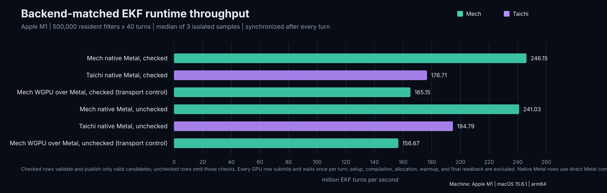
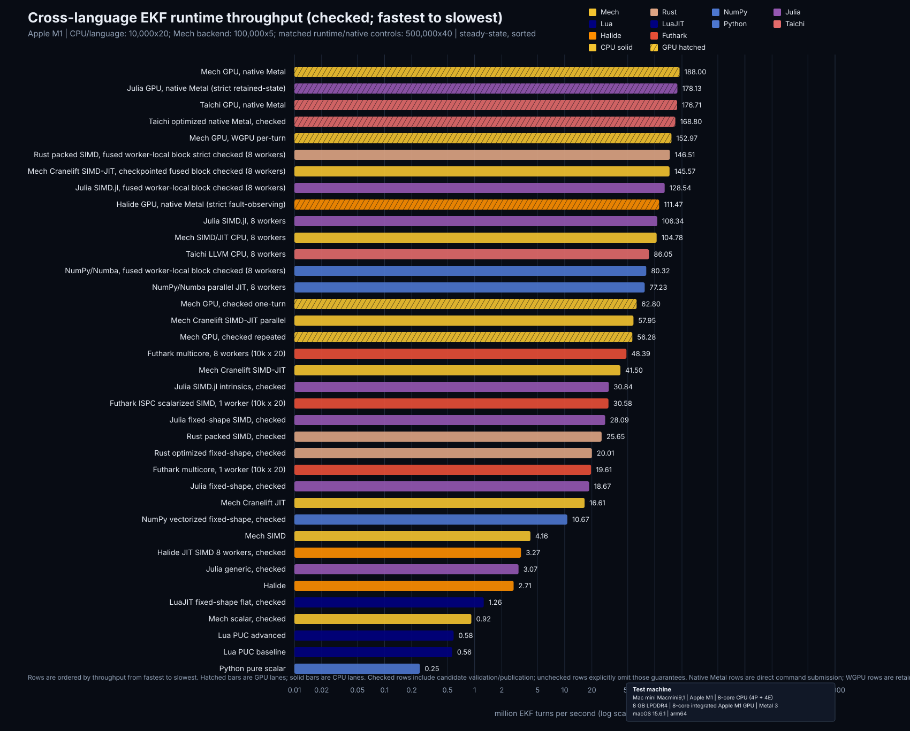
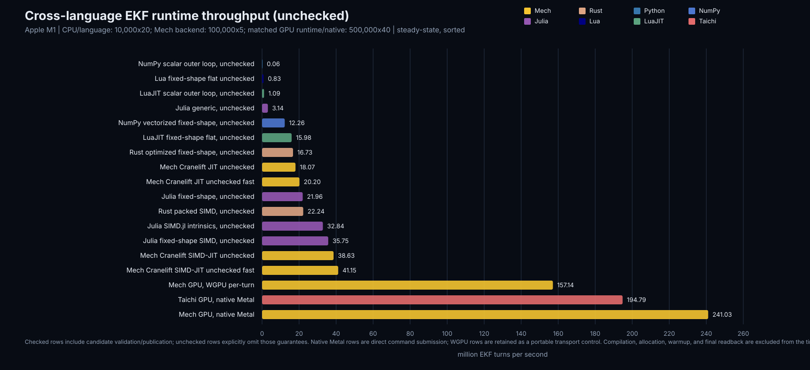
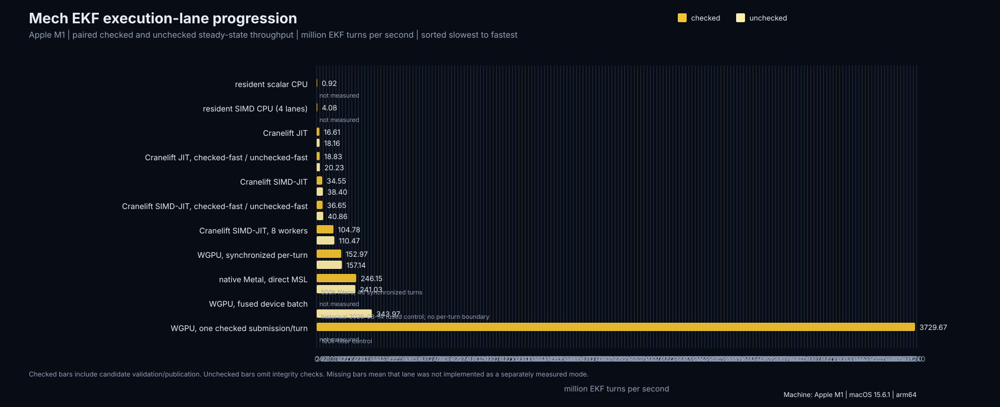
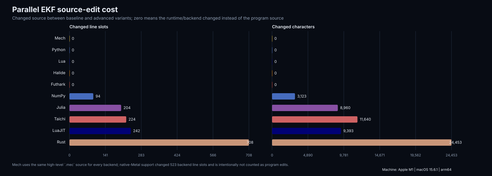

# Parallel EKF backend and scalar-language comparison

This benchmark produces two distinct comparisons from the high-level EKF in
`../../fixtures/ekf-kernel.mec`.

## Exact checkout and source map

The complete spike is on branch `codex/mech-program-gpu` and is reviewed in
[PR #757](https://github.com/mech-lang/mech/pull/757). It is not present in a
plain `integration/value-executor-v0.4` checkout.

```text
git fetch origin codex/mech-program-gpu
git switch --track origin/codex/mech-program-gpu
```

| Role | Checked-in source |
| --- | --- |
| High-level Mech EKF (full reference) | `hosts/gpu/fixtures/ekf-kernel.mec` |
| Minimized Mech EKF source | `benchmarks/archive/compute/parallel-ekf/minimal/ekf-kernel.mec` |
| Taichi-comparable Mech EKF | `hosts/gpu/fixtures/ekf-kernel-taichi-comparable.mec` |
| Source-specialized Taichi control | `benchmarks/archive/compute/parallel-ekf/taichi_optimized.py` |
| Mech artifact benchmark harness | `hosts/gpu/examples/parallel_ekf_benchmark.rs` |
| Generic scalar, SIMD, and WGPU lowering/execution | `hosts/gpu/src/batched.rs` |
| macOS native Metal measurement backend | `hosts/gpu/src/metal.rs` |
| Cranelift lowering/execution | `hosts/gpu/src/batched/jit.rs` |
| Optimized Rust control (full reference) | `hosts/gpu/examples/parallel_ekf_rust_scalar.rs` |
| Rust packed-lane SIMD control (full reference) | `hosts/gpu/examples/parallel_ekf_rust_simd.rs` |
| NumPy control | `benchmarks/archive/compute/parallel-ekf/numpy_scalar.py` |
| Julia generic control | `benchmarks/archive/compute/parallel-ekf/julia_scalar.jl` |
| Julia fixed-shape control | `benchmarks/archive/compute/parallel-ekf/julia_flat.jl` |
| Julia packed-lane control | `benchmarks/archive/compute/parallel-ekf/julia_simd.jl` |
| Julia SIMD intrinsics control | `benchmarks/archive/compute/parallel-ekf/julia_simd_intrinsics.jl` |
| LuaJIT control | `benchmarks/archive/compute/parallel-ekf/luajit_scalar.lua` |
| Plain Lua and LuaJIT fixed-shape control | `benchmarks/archive/compute/parallel-ekf/luajit_fast.lua` |
| NumPy batched fixed-shape control | `benchmarks/archive/compute/parallel-ekf/numpy_vectorized.py` |
| LuaJIT flat fixed-shape control | `benchmarks/archive/compute/parallel-ekf/luajit_fast.lua` |
| Controlled runner | `benchmarks/archive/compute/parallel-ekf/run.py` |
| Minimal NumPy scalar control | `benchmarks/archive/compute/parallel-ekf/minimal/numpy_scalar.py` |
| Minimal NumPy batched control | `benchmarks/archive/compute/parallel-ekf/minimal/numpy_fast.py` |
| NumPy/Numba eight-worker JIT control | `benchmarks/archive/compute/parallel-ekf/minimal/numpy_numba.py` |
| Minimized Rust scalar control | `benchmarks/archive/compute/parallel-ekf/minimal/rust_scalar.rs` |
| Minimized Rust packed-lane SIMD control | `benchmarks/archive/compute/parallel-ekf/minimal/rust_simd.rs` |
| Minimized Julia scalar control | `benchmarks/archive/compute/parallel-ekf/minimal/julia_scalar.jl` |
| Minimized Julia packed-lane SIMD control | `benchmarks/archive/compute/parallel-ekf/minimal/julia_simd.jl` |
| Minimized Julia eight-worker SIMD control | `benchmarks/archive/compute/parallel-ekf/minimal/julia_simd_threads.jl` |
| Julia/Metal resident GPU control | `benchmarks/archive/compute/parallel-ekf/minimal/julia_metal_ekf.jl` |
| Pure-Python scalar control | `benchmarks/archive/compute/parallel-ekf/minimal/pure_python.py` |
| Minimized LuaJIT scalar control | `benchmarks/archive/compute/parallel-ekf/minimal/luajit_scalar.lua` |
| Minimized LuaJIT flat control | `benchmarks/archive/compute/parallel-ekf/minimal/luajit_fast.lua` |
| Minimized Taichi comparable control | `benchmarks/archive/compute/parallel-ekf/minimal/taichi_comparable.py` |
| Minimized Taichi optimized control | `benchmarks/archive/compute/parallel-ekf/minimal/taichi_optimized.py` |
| Minimal Halide fixed-shape pipeline | `benchmarks/archive/compute/parallel-ekf/minimal/halide_ekf.cpp` |
| Minimal Futhark data-parallel program | `benchmarks/archive/compute/parallel-ekf/minimal/futhark_ekf.fut` |
| Futhark/ISPC compatibility shim | `benchmarks/archive/compute/parallel-ekf/minimal/futhark-ispc-compat.sh` |
| NumPy-compatible GPU capability probe | `benchmarks/archive/compute/parallel-ekf/minimal/numpy_gpu.py` |
| Minimal cross-control runner | `benchmarks/archive/compute/parallel-ekf/minimal/measure.py` |
| Compact-source equivalence check | `benchmarks/archive/compute/parallel-ekf/minimal/check_sources.py` |
| Dependency-free chart renderer | `benchmarks/archive/compute/parallel-ekf/plot.py` |
| Matched Mech/Taichi chart renderer | `benchmarks/archive/compute/parallel-ekf/plot_runtime_comparison.py` |
| Cross-language checked/unchecked chart renderer | `benchmarks/archive/compute/parallel-ekf/plot_cross_language_comparison.py` |
| Ranked throughput table | `benchmarks/archive/compute/parallel-ekf/results/parallel-ekf-throughput-table.md` |
| Threaded Julia SIMD evidence | `benchmarks/archive/compute/parallel-ekf/results/apple-m1-julia-threaded-2026-08-31.json` |
| NumPy/Numba threaded evidence | `benchmarks/archive/compute/parallel-ekf/results/apple-m1-numpy-numba-2026-08-31.json` |
| Halide/Futhark SIMD evidence | `benchmarks/archive/compute/parallel-ekf/results/apple-m1-futhark-halide-simd-2026-08-31.json` |
| Halide strict checked Metal evidence | `benchmarks/archive/compute/parallel-ekf/results/apple-m1-halide-metal-strict-2026-08-31.json` |
| Matched Mech/strict-Halide evidence | `benchmarks/archive/compute/parallel-ekf/results/apple-m1-mech-halide-strict-2026-08-31.json` |
| Futhark fixed-mode ISPC evidence | `benchmarks/archive/compute/parallel-ekf/results/apple-m1-futhark-ispc-fixed-2026-08-31.json` |
| Mech persistent SIMD/JIT evidence | `benchmarks/archive/compute/parallel-ekf/results/apple-m1-mech-persistent-simd-2026-08-31.json` |
| Fused Rust/Julia/Numba reference evidence | `benchmarks/archive/compute/parallel-ekf/results/apple-m1-fused-reference-controls-2026-08-31.json` |
| Julia Metal GPU evidence | `benchmarks/archive/compute/parallel-ekf/results/apple-m1-julia-metal-2026-08-31.json` |
| Pure-Python scalar evidence | `benchmarks/archive/compute/parallel-ekf/results/apple-m1-pure-python-2026-09-01.json` |
| Rust scalar checked/unchecked evidence | `benchmarks/archive/compute/parallel-ekf/results/apple-m1-rust-scalar-2026-09-01.json` |
| LuaJIT scalar checked/unchecked evidence | `benchmarks/archive/compute/parallel-ekf/results/apple-m1-luajit-scalar-2026-09-01.json` |
| Taichi one-worker CPU baseline evidence | `benchmarks/archive/compute/parallel-ekf/results/apple-m1-taichi-cpu-baseline-2026-09-01.json` |
| NumPy GPU capability evidence | `benchmarks/archive/compute/parallel-ekf/results/apple-m1-numpy-gpu-2026-08-31.json` |
| Mech execution-lane progression renderer | `benchmarks/archive/compute/parallel-ekf/plot_mech_progression.py` |
| Source-edit cost report/renderer | `benchmarks/archive/compute/parallel-ekf/source_diff_report.py` |
| Per-execution-strategy report/renderer | `benchmarks/archive/compute/parallel-ekf/execution_strategy_report.py` |
| Per-execution-strategy tables/graphs | `benchmarks/archive/compute/parallel-ekf/results/parallel-ekf-execution-strategy-reports.md` |
| Correctness tests | `hosts/gpu/tests/parallel_ekf.rs` |

## Native Metal control

The earlier GPU chart compared Taichi's native Metal backend with Mech's
portable WGPU backend. WGPU selects Apple's Metal implementation on this
machine, but it still adds a separate instance, pipeline, command-encoding,
and synchronization path, so those rows must not be described as an API-level
match.

The corrected control is a macOS-only measurement backend behind the
`native-metal` feature. It takes the same generated Mech WGSL, translates it to
MSL with Naga once during preparation, and submits the resulting function
through Metal's native command queue. The timed region is still resident,
host-driven execution with one completion wait per turn. It does not call
WGPU, and it does not replace the portable runtime backend for other targets.



| Runtime/backend | Checked | Unchecked |
| --- | ---: | ---: |
| Mech native Metal (direct MSL) | 246.151M/s | 241.028M/s |
| Taichi native Metal | 176.710M/s | 194.793M/s |
| Taichi optimized scalar-SoA Metal | 168.798M/s | 217.297M/s |
| Mech WGPU over Metal (transport control) | 165.149M/s | 156.671M/s |

These are medians of three isolated processes on the Apple M1 using 500,000
resident filters and 40 synchronized turns. The native Metal Mech rows came
from `parallel_ekf_benchmark` built with `native,jit,native-metal`, after
specializing the unchecked buffers and using one native Metal binding update
per turn. The Taichi rows came from `taichi_comparable.py` with
`TAICHI_ARCH=metal`. The WGPU rows remain useful for measuring the portable
command path, but are no longer used as the native-Metal comparison. Metal
clocking is noisy; the raw samples are retained so the median, rather than a
single best run, is the reported value.

Raw samples, checksums, and the direct-vs-WGPU distinction are recorded in
`results/apple-m1-mech-taichi-native-metal-2026-08-31.json`.

## Cross-language checked and unchecked charts

The complete comparison is split into two charts so the integrity contract is
never hidden by a mixed bar. Mech rows use the project yellow; Rust, Julia,
Taichi, Halide, and Futhark retain their own family colors. Python and NumPy
share the NumPy blue, while Lua and LuaJIT share the Lua navy.
GPU rows keep their family color but use a diagonal hatch, while CPU rows are
solid, so the accelerator distinction is visible without introducing a second
palette.
Both charts use a logarithmic horizontal throughput axis so the scalar,
SIMD, worker-parallel, and GPU regimes remain legible in one figure.
The CPU language rows use 10,000 resident filters and 20 turns. GPU rows use
100,000 resident filters and 5 synchronized turns. Both are steady-state
throughput measurements; setup, compilation, allocation, and final readback
are outside the timed region. The subtitle on each chart records those two
workloads explicitly. The ranking includes every retained scalar, SIMD/JIT,
worker-parallel, WGPU, native-Metal, and fused GPU lane, including the matched
eight-worker CPU controls at 104.783 M/s checked and 110.469 M/s unchecked.
The persistent Mech worker-pool lane reaches 150.395 M/s with a per-turn
command and 165.830 M/s when the unchecked turn block is submitted as one
command, exceeding the fixed Futhark ISPC unchecked result of 152.330 M/s.





The complete ranked values behind both charts are in
[`results/parallel-ekf-throughput-table.md`](results/parallel-ekf-throughput-table.md).

The chart also includes a NumPy/Numba control using `@njit(parallel=True)` and
an eight-worker `prange` over the same 500,000-filter, 40-turn synchronous
boundary. It is labeled separately from plain NumPy because the JIT and worker
pool are an additional compiled runtime, not a feature of NumPy's array API.
The SIMD controls add Halide's JIT pipeline with eight pinned runtime workers
and Futhark's ISPC backend with eight workers. Futhark does not JIT at runtime;
its source is compiled before the timed invocation. On this machine the
Futhark 0.27 output needs the checked-in compatibility shim with ISPC 1.31,
which removes only unused conflicting `erf`/`erfc` declarations.
Each contract is sorted independently from slowest to fastest, with the new
resident scalar Mech unchecked measurement included explicitly.

The pure-Python row is a standard-library-only scalar control. It uses Python
lists and `math.sin`/`math.cos`/`math.atan2`, so it does not inherit NumPy's
native array kernels or Numba's JIT. At 10,000 filters x 20 turns it measured
**0.246 M/s checked** and **0.356 M/s unchecked**; its raw five-sample evidence
is in `results/apple-m1-pure-python-2026-09-01.json`.

The fused-reference evidence adds the same block boundary to the native
controls: Rust packed SIMD, Julia SIMD.jl, and NumPy/Numba each load a
worker's filters once, advance the complete 40-turn block locally, and publish
the final state once. On the Apple M1, Rust reaches a median **163.866 M
turns/s**, Julia **133.605 M turns/s**, and NumPy/Numba **81.972 M turns/s**,
versus Mech at **165.830 M turns/s**. The rows are included in both charts
from `results/apple-m1-fused-reference-controls-2026-08-31.json`. They expose
the final state after the block; intermediate values still require an explicit
synchronization/checkpoint boundary.

The checked controls now use the same runtime contract. Both evaluate the
finite/diagonal/symmetry predicates, publish a candidate only when the full
checked boundary succeeds, restore the prior published state on a fault, and
carry turn/instance/constraint fault metadata. Rust's corrected control no
longer selectively commits valid lanes from a partially invalid SIMD group.
At the matched 500,000-filter/40-turn boundary, Rust measured
**141.568--146.999 M/s** (median **146.509 M/s**) and Mech measured
**139.668--147.381 M/s** (median **145.573 M/s**). The difference is within
run-to-run scheduling noise, so the earlier Rust value must not be described as
a relaxed guarantee.

Plain PUC Lua now runs the same fixed-shape flat source as LuaJIT. Its table
arrays are explicitly zero-initialized so the warmup has the same defined state
as LuaJIT's FFI arrays. The raw three-sample medians are recorded in
`results/apple-m1-lua-2026-08-31.json`.

The source-specialized Taichi control is also included in both charts. It uses
stock Taichi 1.7.4 and the normal Metal backend, but changes the Taichi program
to scalar component fields, fixed-shape unrolled arithmetic, in-place
unchecked state, and a tuned 32-thread block. It does not modify Taichi's
compiler/runtime or bypass the per-turn `ti.sync()` boundary. Its raw samples
are in `results/apple-m1-taichi-optimized-native-metal-2026-08-31.json`.

The Julia SIMD source also has an eight-worker control using a static threaded
outer loop and a barrier between turns. At the matched 500,000-filter/40-turn
boundary it measured **106.341 M/s checked** and **109.628 M/s unchecked**. This
is the appropriate comparison for Mech's 104.783/110.469 M/s eight-worker
runtime row; the one-worker Julia SIMD rows remain in the language-control
section. Samples and checksums are in
`results/apple-m1-julia-threaded-2026-08-31.json`.

The Mech-only progression view keeps checked and unchecked bars together while
sorting execution lanes from resident scalar through SIMD, Cranelift JIT,
eight-worker SIMD-JIT, synchronized WGPU, direct native Metal, and the fused
device batch. The fused batch is marked historical because it has no per-turn
publication boundary and therefore is not an apples-to-apples replacement for
the synchronized rows.



The throughput charts are paired with a source-edit inventory. It measures the
actual baseline-to-advanced edit surface rather than comparing file lengths:
changed line slots, changed character slots, and each variant's distance from
the base Mech `.mec`. The full matrix also records code-only line/character
counts, data layout, turn boundary, validation contract, and checked/unchecked
throughput for both sides of each pair, plus the best checked/unchecked result
for single-core, SIMD/multicore, and GPU execution classes. This makes both the
portability cost and the performance ceiling visible. Mech's high-level source
delta is zero because the same program is compiled to every backend; the
native-Metal implementation work is explicitly identified as backend support
instead of being hidden as a source rewrite. The GPU maxima use synchronized
per-turn rows; fused or repeated device-resident rows remain visible in the
ranked throughput table and JSON as a separate batch ceiling.



The complete table is in
`results/parallel-ekf-source-diff-report.md`, with machine-readable metrics in
`results/parallel-ekf-source-diff-report.json`.

That source-edit mega view is intentionally complemented by compact
execution-strategy views. `results/parallel-ekf-execution-strategy-reports.md`
links one diff table and one graph for interpreted-baseline, compiled-baseline,
single-core, multicore, synchronized-GPU, and GPU-batch strategies. The old
mixed baseline remains as a historical compatibility view. The split baseline
charts use linear axes within their execution regime; languages without a
result are omitted from the bars and listed under the report's missing-backend
notes. Each measured row keeps checked and unchecked throughput separate.

The report now measures the checked-in compact controls under `minimal/`, not
the explanatory listings. The Mech control is a single 42-line code-only
recurrence with one statement per line, compact matrix literals, broadcast
inputs, and the three publication predicates. The other compact controls are
comment-free copies of the same benchmark programs; their harness behavior is
unchanged, so source size is not being reduced by deleting numerical work.
The longer reference files remain in the source map for auditability.

The scalar Mech evidence now includes both publication modes: on this Apple
M1 rerun, checked resident CPU measured **0.919 M EKF-turns/s** and unchecked
resident CPU measured **1.029 M EKF-turns/s** at 10,000 lanes and 20 turns.
The unchecked run uses `without_integrity_constraints()` in the same CPU
executor and matched the checked checksum within `1e-4`.

## Minimal Halide and Futhark controls

The `minimal/` directory adds two independent controls for the same resident
EKF workload. `halide_ekf.cpp` builds one fixed-shape Halide JIT pipeline and
executes it for a host-synchronized turn loop. `futhark_ekf.fut` maps one
fixed-shape EKF over all lanes and can be compiled to Futhark's multicore or
OpenCL backends. Both programs expose `checked` and `unchecked` modes; checked
mode validates the candidate state and covariance and publishes the previous
lane when validation fails. Compilation and allocation are outside the timed
loop. Halide calls the pipeline once per measured turn; Futhark keeps its
`turns` loop inside one compiled invocation, so its rows measure a resident
data-parallel loop without a host wait between individual turns. That boundary
difference is recorded here rather than presented as an apples-to-apples
replacement for the synchronized Mech/Taichi rows.

On the Apple M1 control machine, the CPU controls use 10,000 lanes x 20 turns
and the native GPU controls use the matched 500,000 lanes x 40 turns workload.
The fused Halide measurement uses 500 turns to amortize the per-process GPU
clock variance; its result is reported separately below.

| Control | Checked M turns/s | Unchecked M turns/s |
| --- | ---: | ---: |
| Halide JIT | 2.707 | 5.058 |
| Halide native Metal GPU, fused (500 turns) | 274.112 | 275.831 |
| Futhark multicore, 8 workers | 48.391 | 47.824 |

The earlier fused-only Halide row uses the same fixed-shape EKF expression and
per-turn publication boundary as the CPU control, scheduled with `gpu_tile` and
compiled for native Metal. It emits twelve state outputs as one fused tuple
kernel, materializes shared scalar intermediates once per lane, and keeps state
and input buffers device-resident during the timed loop. Its checked number is a
kernel-throughput control only: it did not expose per-lane fault observations.
The strict checked measurement is separate below. The GPU schedule is an
Apple-Metal control, not a WGPU transport comparison.

The strict Halide control emits a thirteenth per-lane fault-code output in the
same fused kernel. After each synchronized turn the host scans that output,
reports the first failing lane and constraint, and the kernel selects the prior
published state for every invalid lane. It checks finite state and covariance,
positive covariance diagonal entries, and covariance symmetry with the same
tolerance used by the Mech control. On 500,000 filters x 40 turns (five fresh
processes), the medians were:

| Control | Checked M turns/s | Unchecked M turns/s |
| --- | ---: | ---: |
| Halide native Metal, strict fault-observing | 111.474 | 212.283 |
| Mech native Metal, retained-state/fault-reporting | 187.999 | 275.534 |

Raw samples and zero-fault evidence are in
`results/apple-m1-halide-metal-strict-2026-08-31.json`. This is the fair
checked control for comparisons with Mech's retained-state and fault-reporting
contract; the older 274.112 M/s checked row must not be used for that claim.
The matched Mech run is retained in
`results/apple-m1-mech-halide-strict-2026-08-31.json`; its checked path uses a
two-word device fault reduction, so it reports the same first-fault metadata
without copying a per-lane fault array to the host each turn. That is an
implementation advantage, not a weaker validity contract.

The Julia Metal control is held to the same boundary. Its checked mode now
uses two resident state groups, writes candidates only to the unpublished
group, records the first failing lane/constraint in a two-word atomic summary,
and reads that summary after every synchronized turn before swapping the
published group. The earlier Julia result (197.078 M checked turns/s) used
in-place valid-lane publication and post-loop fault observation, so it is not
an equivalent checked result and is excluded from the current ranking. The
strict rerun is 178.135 M checked turns/s and 199.454 M unchecked turns/s;
Mech is 187.999 M and 275.534 M/s under the same 500,000-filter, 40-turn
per-turn boundary.

The Futhark OpenCL compiler is installed on that machine, but its Apple OpenCL
driver rejects the generated kernel (`Invalid kernel`), so those rows are
recorded as unavailable rather than silently omitted. The full samples,
checksums, commands, and availability status are in
`results/apple-m1-minimal-source-2026-08-31.json`; the matched Metal-only
invocation is retained as `results/apple-m1-halide-metal-fused-2026-08-31.json`.

Re-run the controls after installing the tools (`brew install halide futhark`)
with:

```text
/tmp/mech-ekf-venv/bin/python minimal/measure.py \
  --python /tmp/mech-ekf-venv/bin/python \
  --instances 10000 --turns 20 --samples 5 --halide-metal

# Matched GPU workload (Halide strict checked contract and unchecked control)
python3 minimal/measure_halide_gpu.py \
  --instances 500000 --turns 40 --samples 5 \
  --output results/apple-m1-halide-metal-strict-2026-08-31.json
```

The runner uses one OpenMP/BLAS thread for NumPy, compiles Halide with `-O3`,
and pins Futhark's multicore control to one and eight workers. It reports
steady-state throughput only; JIT compilation, warmup, and input construction
are not included in those numbers. The strict Halide checked row deliberately
keeps its per-turn fault-buffer readback inside the timed region because fault
observation is part of that contract.

Regenerate the charts and ranked table from the checked-in evidence with:

```text
python3 plot_cross_language_comparison.py \
  results/apple-m1-checked-cross-language-2026-08-31.json \
  results/apple-m1-mech-taichi-runtime-2026-08-31.json \
  results/apple-m1-mech-taichi-native-metal-2026-08-31.json \
  results \
  results/apple-m1-lua-2026-08-31.json \
  --taichi-optimized results/apple-m1-taichi-optimized-native-metal-2026-08-31.json \
  --minimal-source results/apple-m1-minimal-source-2026-08-31.json \
  --halide-gpu results/apple-m1-halide-metal-strict-2026-08-31.json \
  --julia-threaded results/apple-m1-julia-threaded-2026-08-31.json \
  --numpy-numba results/apple-m1-numpy-numba-2026-08-31.json \
  --simd-controls results/apple-m1-futhark-halide-simd-2026-08-31.json \
  --futhark-fixed results/apple-m1-futhark-ispc-fixed-2026-08-31.json \
  --mech-persistent results/apple-m1-mech-persistent-simd-2026-08-31.json \
  --fused-references results/apple-m1-fused-reference-controls-2026-08-31.json \
  --julia-gpu results/apple-m1-julia-metal-2026-08-31.json \
  --pure-python results/apple-m1-pure-python-2026-09-01.json \
  --numpy-gpu results/apple-m1-numpy-gpu-2026-08-31.json \
  --strict-mech results/apple-m1-mech-halide-strict-2026-08-31.json

python3 plot_mech_progression.py \
  results/apple-m1-checked-cross-language-2026-08-31.json \
  results/apple-m1-mech-taichi-runtime-2026-08-31.json \
  results/apple-m1-mech-taichi-native-metal-2026-08-31.json \
  results/apple-m1-2026-08-14.json \
  results/parallel-ekf-mech-progression.svg

python3 source_diff_report.py \
  results/apple-m1-checked-cross-language-2026-08-31.json \
  results/apple-m1-mech-taichi-native-metal-2026-08-31.json \
  results/apple-m1-taichi-optimized-native-metal-2026-08-31.json \
  results/apple-m1-lua-2026-08-31.json \
  results \
  --strict-mech results/apple-m1-mech-halide-strict-2026-08-31.json \
  --strict-halide results/apple-m1-halide-metal-strict-2026-08-31.json \
  --strict-julia results/apple-m1-julia-metal-2026-08-31.json \
  --pure-python results/apple-m1-pure-python-2026-09-01.json

# Measure source-to-artifact and first-run compiler costs for every retained
# language control, then let source_diff_report.py include the medians in its
# baseline / advanced compile column.
python3 measure_compile_times.py \
  --python /path/to/python-with-numpy \
  --taichi-python /path/to/python-with-taichi

python3 plot_compile_times.py \
  results/apple-m1-compile-times-2026-09-01.json \
  results/parallel-ekf-compile-times.svg

python3 execution_strategy_report.py --results results
```

The resulting `results/apple-m1-compile-times-2026-09-01.json` records every
command, sample, median, and unavailable tool. Rust, Halide, and Futhark rows
measure AOT artifact creation; Python, Lua, and LuaJIT rows measure bytecode
creation; Julia and Taichi rows measure a cold process plus first-call/kernel
specialization. These phases are labeled separately because they are not
steady-state runtime throughput.

To isolate the direct control from the other backend warmups, build the
benchmark with `native,jit,native-metal` and run:

```sh
MECH_NATIVE_METAL_ONLY=1 \
  target/release/examples/parallel_ekf_benchmark 500000 1 40 40
```

The optional `MECH_METAL_THREADS_PER_THREADGROUP` variable overrides the
native default of 64 for hardware tuning; it is printed with every isolated
sample.

## Taichi parity harness

`taichi_comparable.py` is a checked-in control, not a hand-written result
stub. It uses Taichi `Vector.field` and `Matrix.field` values for the same
3-state/3x3-covariance resident layout, the same f32 constants and three
resident lane inputs, and the same Joseph covariance update as
`ekf-kernel-taichi-comparable.mec`. The unchecked kernel advances the resident
fields directly. The checked kernel uses two resident state/covariance pairs,
validates the complete candidate, and publishes the alternate pair only when
the candidate is valid. A failed lane records a two-word atomic fault summary
and the prior published pair remains selected. That is the Mech checked
publication contract, rather than a post-hoc assertion after overwriting
state.

Both modes call `ti.sync()` once per measured turn. This is intentional: it
measures a steady-state host-driven loop and does not let asynchronous device
work accumulate. Mech's checked path likewise maps the compact two-word fault
status before publishing each turn. For a device-resident batch comparison,
use Mech's explicit fused unchecked mode; it is a different boundary and is
reported separately.

The harness requires a Python version supported by the installed Taichi
release (the Apple run used Python 3.12 and Taichi 1.7.4):

```text
python3 -m venv .venv312
.venv312/bin/python -m pip install "taichi==1.7.4" "numpy>=2"
TAICHI_ARCH=metal .venv312/bin/python taichi_comparable.py 100000 120 unchecked
TAICHI_ARCH=metal .venv312/bin/python taichi_comparable.py 100000 120 checked
TAICHI_ARCH=metal .venv312/bin/python taichi_comparable.py 100000 120 unchecked-batched
```

For a CPU comparison, select Taichi's LLVM backend explicitly. `--cpu-threads
1` is the closest available SIMD-only control: it removes thread-level
parallelism, but Taichi still does not promise that every operation is emitted
as a vector instruction. Omit the option to use Taichi's default CPU worker
pool, or pin it to the machine's worker count when reproducing a run:

```text
TAICHI_ARCH=cpu .venv312/bin/python taichi_comparable.py 100000 20 unchecked --cpu-threads 1
TAICHI_ARCH=cpu .venv312/bin/python taichi_comparable.py 100000 20 checked --cpu-threads 1
TAICHI_ARCH=cpu .venv312/bin/python taichi_comparable.py 100000 20 unchecked --cpu-threads 8
TAICHI_ARCH=cpu .venv312/bin/python taichi_comparable.py 100000 20 checked --cpu-threads 8
```

The three-process median controls below were measured on the Apple M1 (8 logical
CPUs), with 100,000 resident filters and `ti.sync()` after every turn. The
single-worker rows isolate Taichi's LLVM lowering and any compiler
auto-vectorization from worker-pool parallelism; they are not a guarantee of a
particular SIMD width. The eight-worker rows include Taichi's CPU scheduling
and parallel outer loop.

| Taichi CPU mode | Million EKF-turns/s |
| --- | ---: |
| Unchecked, one worker | 23.616 |
| Checked, one worker | 20.695 |
| Unchecked, eight workers | 94.381 |
| Checked, eight workers | 82.607 |

The same resident Mech artifact on this checkout measured approximately 41.2M
unchecked-fast and 36.1M checked-fast turns/s through the four-lane Cranelift
SIMD-JIT path in one benchmark process. These are directional comparisons,
not a claim that Taichi's one-worker mode is a hand-written SIMD kernel:
Taichi receives an explicit `for i in range(N)` and lets LLVM decide its CPU
parallel/vector lowering, while Mech's SIMD lane width is explicit. Use the
worker count and synchronization policy in the result table whenever comparing
the two.

## Prior hardware-level chart (transport not matched)

The following chart is retained for historical context. Its Taichi Metal rows
and Mech WGPU rows run on the same hardware and shader workload, but not
through the same GPU API; use the native-Metal control above for an API-level
comparison.

The parallel SIMD-JIT entry point partitions complete four-lane groups across
eight scoped workers. Workers join before the next turn begins, so this remains
a synchronous resident loop with the same state publication and fault boundary
as the single-worker path. The checked path retains the previously published
state when any worker reports an invalid candidate.

The chart below uses the same 500,000 resident filters, 40 measured turns,
three isolated process samples, and synchronization after every turn for both
runtimes. Mech's GPU rows use one host dispatch per turn; Taichi's Metal rows
call `ti.sync()` after each kernel turn. CPU rows use eight workers. Setup,
compilation, allocation, warmup, and final readback are excluded.


| Runtime/backend | Checked | Unchecked |
| --- | ---: | ---: |
| Mech SIMD/JIT CPU, 8 workers | 104.783M/s | 110.469M/s |
| Taichi LLVM CPU, 8 workers | 86.047M/s | 98.140M/s |
| Mech WGPU GPU, per-turn dispatch | 152.972M/s | 157.141M/s |
| Taichi Metal GPU, per-turn sync | 179.504M/s | 222.210M/s |

The checked Mech GPU path is within 15% of the Taichi Metal control, while the
parallel checked and unchecked CPU paths exceed Taichi's eight-worker CPU
throughput. The remaining unchecked GPU gap is a launch/device-code tuning
target; it is not hidden by batching, because every row above waits at the
turn boundary. Raw medians and all individual samples are recorded in
`results/apple-m1-mech-taichi-runtime-2026-08-31.json`.

Regenerate the SVG from the checked-in measurements with:

```text
python3 plot_runtime_comparison.py \
  results/apple-m1-mech-taichi-runtime-2026-08-31.json \
  results/apple-m1-mech-taichi-runtime-2026-08-31.svg
```

The complete runner can execute both controls and compare their fresh-session
checksums with the Mech GPU results. It pins the Taichi backend explicitly and
records the raw process output when evidence is requested:

```text
python3 run.py --taichi-python /path/to/.venv312/bin/python \
  --taichi-arch metal --backend-instances 100000 --backend-gpu-turns 120 \
  --evidence-output results/apple-m1-taichi-parity.json
```

Pass `--taichi-script taichi_optimized.py` to run the source-specialized
scalar-SoA control through the same evidence runner.

On the Apple M1/Metal sanity runs used while adding this harness, five
per-turn synchronized turns measured approximately 264M unchecked and 103M
checked Taichi filter-turns/s. The corresponding Mech generic WGPU path was
approximately 65M unchecked and 54--64M checked one-turn filter-turns/s, with
matching f32 checksums. Mech's ordinary unchecked multi-dispatch path reached
approximately 325M turns/s when five turns were encoded into one submission;
that is the relevant apples-to-apples comparison against a device-resident
Taichi batch, not the per-turn host boundary. Metal scheduling is noisy, so
new evidence must use the runner's medians rather than a single process.

`unchecked-batched` is the device-resident control: it advances all requested
turns inside one Taichi kernel and synchronizes once. It is compared with
Mech's `prepare_resident_unchecked_fused` result. It must not be compared with
the checked per-turn rows, because neither control performs a publication or
fault readback at every intermediate turn in that mode.

The result is not that Taichi has a capability Mech fundamentally lacks. Its
compiler receives the outer `for i in range(N)`, fixed field shapes, and a
device-selected kernel as explicit program structure. Mech currently derives
the same outer broadcast from array extents, scalarizes the generic artifact,
and preserves host-visible transaction boundaries. That gives Taichi more
room for loop fusion, matrix scalar replacement, and backend-specific launch
tuning. Mech can recover those opportunities by specializing the lowered
region and by making device-resident batching an explicit execution policy;
the source-level recurrence and its checked semantics do not need to change.

## Mech physical backends

The scalar CPU, four-lane SIMD CPU, Cranelift JIT, and GPU lanes execute the
same compiler artifact and persistent per-filter state. The SIMD
implementation changes only the physical value type of the scalarized
instruction stream to `wide::f32x4`; it uses NEON on Apple Silicon and SSE
where available. The JIT converts that instruction stream into one native SSA
function containing the complete outer filter loop. The primary GPU lane
submits and synchronizes one Mech turn at a time.

The Mech source itself declares `finite-candidate!`,
`positive-covariance!`, and `symmetric-covariance!` using generic numeric,
comparison, Boolean, and matrix-index operations. There is no EKF validation
primitive or separate Rust publication policy. Constraint names survive
artifact and bytecode encoding, affect artifact identity, and are reported by
structured faults. A failed candidate is rejected before the published buffer
changes. The session records only a fault count and latest named fault, so
fault evidence cannot grow an unbounded log. GPU turns read a compact device
fault status before advancing the published ping-pong buffer; checked
multi-turn calls therefore execute as repeated checked turns.

The table below is the preserved **unchecked** Apple M1 baseline from commit
`6b27e4cdbcdd53ddb0c646169be0bb597bd2a39e`: five-process median after one
discarded warmup, 100,000 filters, 2026-08-14. It predates the integrity policy
and must not be presented as checked throughput.

| Mech backend | Million EKF-turns/s | Scalar speedup |
| --- | ---: | ---: |
| Mech scalar artifact evaluator | 1.216 | 1.00x |
| Mech SIMD (`4xf32`) | 4.414 | 3.63x |
| Mech Cranelift JIT | 17.306 | 14.23x |
| Mech GPU, one submission/turn | 53.557 | 44.04x |
| Mech GPU, 120 turns/submission | 343.969 | 282.87x |

Parsing, artifact compilation, scalarization, JIT compilation, input
construction, allocation, GPU setup, warmup, final readback, and correctness
checks are outside the timed regions. Cranelift `0.131.3` is pinned because it
supports the repository's Rust `1.92` minimum. JIT preparation took `3.340 ms`
in the first recorded hardware run. Its state matched the scalar evaluator
bit-for-bit after four validation turns.

## Initial checked evaluated artifact

Commit `7605c5c9081a22d7bcba0b0c288570a7c3a41f41` compiles the three
source-authored constraints into every backend. Five release-mode processes
on Apple M1 Metal, with 100,000 filters, three scalar reference turns, 20
single GPU samples, and 120 repeated checked GPU turns, produced these
medians:

| Checked Mech backend | Time/turn | Million EKF-turns/s | Unchecked reference | Relative change |
| --- | ---: | ---: | ---: | ---: |
| Scalar artifact evaluator | 122.212 ms | 0.818 | 1.216 | -32.7% |
| SIMD (`4xf32`) | 31.702 ms | 3.154 | 4.414 | -28.5% |
| Cranelift JIT | 8.105 ms | 12.339 | 17.306 | -28.7% |
| GPU, one checked submission/turn | 1.942 ms | 51.497 | 53.557 | -3.8% |
| GPU, repeated checked turns | 1.767 ms | 56.580 | not comparable | not comparable |

Source parsing, artifact construction, and scalarization took a median
`107.022 ms`; JIT preparation took `3.573 ms`. Maximum CPU/GPU absolute error
was `6.866e-5`, and JIT output matched scalar output bit-for-bit. The Apple
Metal correctness suite passed all nine tests, including injected finite,
positive-diagonal, and symmetry failures and proof that an invalid GPU
candidate leaves the previous state published.

The old `343.969 M/s` GPU number is deliberately excluded from the overhead
calculation: it publishes only after a 120-turn command batch, while the
checked repeated lane validates before every publication. Comparing those
numbers would attribute a guarantee-boundary change to constraint arithmetic.
All five checked process samples are preserved in
[`results/apple-m1-checked-integrity-2026-08-14.json`](results/apple-m1-checked-integrity-2026-08-14.json).

## Optimized checked artifact

Commit `efc85d48e562fe4ccc1af535e04f9bf4617e05a6` keeps the same source
constraints, named faults, candidate rejection, bounded fault state, and
previous-estimate retention. It changes their generic execution strategy:

- constraint-only Boolean graphs compile as predicates rather than `f32`
  result registers;
- dead numeric instructions are removed after tracing state outputs and
  predicate inputs;
- `abs(x) <= f32::MAX` lowers to exact `f32` finiteness testing and
  `abs(left - right) <= tolerance` lowers to one predicate;
- SIMD comparisons remain native masks until the final fault decision; and
- JIT code returns its first packed fault instead of writing and rescanning a
  result for every filter.

Five isolated release processes on the same Apple M1 Metal adapter, with
100,000 filters, five scalar reference turns, 40 single GPU samples, and 120
repeated checked GPU turns, produced:

| Checked Mech backend | Time/turn | Million EKF-turns/s | Initial checked | Change | Unchecked reference | Remaining checked cost |
| --- | ---: | ---: | ---: | ---: | ---: | ---: |
| Scalar artifact evaluator | 106.286 ms | 0.941 | 0.818 | +15.0% | 1.216 | -22.6% |
| SIMD (`4xf32`) | 26.233 ms | 3.812 | 3.154 | +20.9% | 4.414 | -13.6% |
| Cranelift JIT | 6.849 ms | 14.600 | 12.339 | +18.3% | 17.306 | -15.6% |
| GPU, one checked submission/turn | 1.630 ms | 61.348 | 51.497 | +19.1% | 53.557 | noisy |
| GPU, repeated checked turns | 1.820 ms | 54.959 | 56.580 | -2.9% | not comparable | not comparable |

Source parsing, artifact construction, and scalarization took a median
`64.134 ms`; JIT preparation took `3.494 ms`. Maximum CPU/GPU absolute error
remained `6.866e-5`, and JIT output remained bit-for-bit equal to scalar.
All 27 package tests passed, including the three injected integrity failures
and GPU publication retention. The generated WGSL shrank from 13,908 to
11,733 bytes as dead constraint arithmetic disappeared.

## Explicit unchecked GPU path

The benchmark now has a separate opt-in unchecked artifact. Calling
`FixedShapeKernel::without_integrity_constraints` removes the three source
predicates from the generated WGSL and removes the atomic fault binding. The
native session exposes two distinct measurements:

- `dispatch_turns(1)` is the one-turn, host-driven loop. It still waits for
  completion after every submission, but it performs no predicate or fault
  work on the device.
- `dispatch_turns(120)` on the same unchecked artifact batches 120 ordinary
  dispatches into one command submission. This isolates command/state traffic
  from validation without changing the one-turn kernel.
- `prepare_resident_unchecked_fused(..., turns)` plus
  `dispatch_unchecked_fused()` loads each lane once, advances the configured
  number of turns in device-local state, and writes the final state once. It
  uses one command submission and has no rollback boundary.

Both paths are checked against the generic CPU lowering before timing. On the
Apple M1, a 100,000-filter sanity run measured approximately `62 M/s` for the
unchecked one-turn loop and `3,900 M/s` when 120 unchecked turns were fused
inside one device invocation. The latter is deliberately reported as a
batched/device-resident result; it is not a one-turn kernel comparison. The
checked path remains the reference for per-turn publication and retains the
previous estimate on an invalid candidate.

GPU one-turn samples ranged from `47.859` to `62.495 M/s`; per-turn host
synchronization still dominates and makes this too noisy to attribute the
median change to device predicate lowering. Raw samples, command parameters,
implementation commit, and validation commands are preserved in
[`results/apple-m1-checked-integrity-optimized-2026-08-14.json`](results/apple-m1-checked-integrity-optimized-2026-08-14.json).

## Scalar outer-loop languages

Every lane owns 10,000 persistent filters and executes one filter at a time
for five warmup turns, a state reset, and 20 measured turns. Inputs, equations,
`f32` state, Joseph covariance update, and checksums agree. "Scalar" here means
the outer filter loop is sequential. It does not claim that a language's
scalar math or small matrix library avoids every SIMD instruction internally.

Apple M1 median of five processes after one discarded process warmup, except
seven LuaJIT samples:

| Scalar outer-loop lane | Million EKF-turns/s | Relative to Mech scalar |
| --- | ---: | ---: |
| Mech scalar artifact evaluator | 1.213 | 1.00x |
| Mech Cranelift JIT | 17.390 | 14.34x |
| Rust optimized fixed-shape | 20.299 | 16.73x |
| NumPy sequential small matrices | 0.055 | 0.05x |
| Julia sequential small matrices | 2.786 | 2.30x |
| LuaJIT sequential FFI `f32` state | 1.089 | 0.90x |

The Rust control permits inlining of the EKF step and its fixed-shape matrix
helpers. The previous `#[inline(never)]` control measured `12.947 M/s`, but it
was not a fair native-code ceiling once the JIT owned and fused the outer
filter loop. Under identical 10,000-filter, 20-turn settings, the JIT reaches
`85.7%` of the optimized Rust throughput.

Versions were Rust `1.96.0-nightly`, Python `3.14.6`, NumPy `2.5.2`, Julia
`1.12.6`, and LuaJIT `2.1.1785763465`. NumPy, Julia BLAS, and related native
thread counts were pinned to one.

The publication evidence is checked in as
[`results/apple-m1-2026-08-14.json`](results/apple-m1-2026-08-14.json). It was
generated from commit `6b27e4cdbcdd53ddb0c646169be0bb597bd2a39e` and contains
all discarded warmups and measured stdout. This file is retained as pre-policy
evidence rather than silently relabeled. The raw samples also show why these
figures remain provisional: synchronized GPU samples ranged from `48.613` to
`65.510 M/s`, while the JIT backend samples stayed between `17.225` and
`17.343 M/s` at the 100,000-filter setting.

Build the native Mech benchmark, then run the complete comparison:

```text
cargo build -p mech-gpu --release --features native,jit --example parallel_ekf_benchmark
python3 benchmarks/archive/compute/parallel-ekf/run.py --python /path/to/python-with-numpy
```

Add `--evidence-output /path/to/results.json` to record the exact Git commit,
platform, tool versions, thread environment, commands, discarded warmups,
every measured process stdout, parsed checksums, and summary medians. Published
results should include this generated JSON rather than only the tables above.

The runner compiles the checked-in Rust control directly with
`rustc -C opt-level=3 -C target-cpu=native`, validates every scalar and JIT
checksum, and prints both Markdown tables.

## Julia inlining probe

The Julia control in this checkout uses `Base.@inline` on `step!`.  This is a
deliberate optimization hint for the scalar outer loop, not a change to the
EKF equations or storage.  On the Apple M1, nine isolated 20-turn processes
with 10,000 filters produced `3.091M` lane-turns/s median.  The same source
with the annotation removed produced `2.875M`; the original `Base.@noinline`
source produced `2.852M`.  A longer 100-turn corroboration produced `3.069M`,
`2.820M`, and `2.800M`, respectively.  Checksums were identical across all
variants and one-process startup wall time remained within `1.57--1.59s`.  The
detailed commands and raw medians are in
[`results/julia-inline-apple-m1-2026-08-30.md`](results/julia-inline-apple-m1-2026-08-30.md).

The Julia comparison has four sequential modes plus two packed-lane
implementations. The generic source uses
ordinary heap-backed `Matrix` values and `mul!`, which is the closest
translation of the high-level Mech matrix expressions. The fixed-shape source
uses flat `Float32` buffers and compile-time 3x3/3x2 products, matching the
storage and operation shape of the optimized Rust control. Both sources accept
`unchecked` or `checked` as a third argument. Checked mode evaluates the same
finite-state, finite-covariance, positive-diagonal, and covariance-symmetry
predicates as the Mech artifact before publishing a candidate; a failed
candidate leaves the prior state unchanged and increments the fault count.
The runner executes all eight Julia rows plus scalar and packed-SIMD Rust
controls. The scalar Rust control remains an unchecked reference; the packed
Rust control has both checked and unchecked modes.

The source-shaped NumPy and LuaJIT controls remain available as
`numpy_scalar.py` and `luajit_scalar.lua`. Their companion fast lanes,
`numpy_vectorized.py` and `luajit_fast.lua`, batch the outer population and
replace generic matrix loops with fixed 3x3 products. Both accept `checked` or
`unchecked`: checked mode validates every candidate and publishes it only when
the finite, positive-diagonal, and symmetry predicates pass. The LuaJIT fast
lane keeps scalar intermediate registers, so its aggregate checksum is allowed
the same scale-aware `f32` tolerance recorded by the runner; this does not
change its state-update or validation policy.

In a five-process Apple M1 probe with 10,000 filters and 20 measured turns,
the current medians were:

| Julia implementation | Validation | Million lane-turns/s |
| --- | --- | ---: |
| Generic Matrix/`mul!` | unchecked | 3.09 |
| Generic Matrix/`mul!` | checked | 3.08 |
| Fixed-shape flat tuples | unchecked | 21.9 |
| Fixed-shape flat tuples | checked | 19.0 |

All four modes produced the same checksum within the existing `f32`
tolerance. The fixed-shape checked result is the relevant comparison to a
checked Mech numeric backend; the unchecked result isolates arithmetic and
storage cost only.

## Julia packed-lane comparison

`julia_simd.jl` gives Julia the same four-filter physical execution shape as
Mech's SIMD-JIT lane. It stores each state and covariance component as a
`StaticArrays.SVector{4,Float32}`, advances four independent filters per outer
iteration, uses Julia's `sincos` pair, and keeps the same checked-mode
finite/positive-diagonal/symmetry predicates. A fully valid group takes a
branch-only publication path; per-lane `ifelse` rollback is materialized only
when a lane fails. This is a fair packed-lane Julia comparison, while the
generic and fixed-shape sequential rows remain available to show the cost of
the language/runtime shape itself.

On this Apple M1 checkout with 100,000 filters and 100 measured turns (after
the script's five-turn warmup), the direct runs were:

| Julia implementation | Validation | Million lane-turns/s |
| --- | --- | ---: |
| Fixed-shape flat tuples | unchecked | 22.69 |
| Fixed-shape flat tuples | checked | 19.57 |
| Fixed-shape packed `SVector{4}` | unchecked | 37.72 |
| Fixed-shape packed `SVector{4}` | checked | 29.83 |
| Packed `SIMD.jl Vec{4,Float32}` | unchecked | 34.55 |
| Packed `SIMD.jl Vec{4,Float32}` | checked | 32.88 |

The packed source produced the same `26,697,851.679688` checksum as the flat
source (within `f32` accumulation rounding). The checked packed result is
therefore close to Mech's checked SIMD-JIT result on this run, rather than an
unchecked Julia-only advantage. The `StaticArrays` source needs `StaticArrays`;
the intrinsic source needs `SIMD.jl` (tested with SIMD.jl 3.7.2). Both are
ordinary Julia packages and must be installed in the Julia environment used by
the runner.

At the runner's 10,000-filter/20-turn setting, five isolated Julia intrinsic
processes measured a median of `31.34M` checked and `32.54M` unchecked
lane-turns/s. Five corresponding Mech SIMD-JIT processes measured `31.16M`
checked-fast and `32.65M` unchecked-fast. The remaining difference is within
normal process noise; this is now the relevant performance target for the
SIMD-capable path, not the sequential `19M` result.

## Rust packed-lane control and current cross-language chart

`parallel_ekf_rust_simd.rs` is a separate Rust ceiling control. It stores each
state and covariance component in structure-of-arrays form, advances four
filters with `wide::f32x4`, uses the same scalar transcendental fallback as the
current Mech Cranelift SIMD-JIT, and implements the same finite, positive
diagonal, and covariance-symmetry publication checks. It is therefore a real
Rust SIMD comparison, not a scalar Rust result relabeled as SIMD. It is still
specialized source: it does not demonstrate that the Rust compiler can infer
this layout from the high-level EKF automatically.

The current three-process Apple M1 evidence is recorded in
[`results/apple-m1-simd-cross-language-2026-08-30.json`](results/apple-m1-simd-cross-language-2026-08-30.json).
The chart below is generated only from that evidence file by `plot.py` and uses
one shared 0--60 million-turns/s axis:


The checked-only view is available separately for reviews that require every
row to retain the integrity policy. The latest checked rerun uses the packed
SIMD-JIT Mech executor from the current branch:


| Control | Validation | Million EKF-turns/s |
| --- | --- | ---: |
| Rust fixed-shape scalar | unchecked | 16.69 |
| Rust packed `wide::f32x4` | checked | 25.68 |
| Rust packed `wide::f32x4` | unchecked | 20.87 |
| Mech Cranelift SIMD-JIT | checked-fast | 37.21 |
| Mech Cranelift SIMD-JIT | unchecked-fast | 41.34 |
| Julia `SIMD.jl Vec{4,Float32}` | checked | 31.18 |
| Julia `SIMD.jl Vec{4,Float32}` | unchecked | 32.87 |
| NumPy vectorized fixed-shape | checked | 10.69 |
| NumPy vectorized fixed-shape | unchecked | 12.31 |
| LuaJIT flat fixed-shape | checked | 1.27 |
| LuaJIT flat fixed-shape | unchecked | 15.98 |

On this run, the specialized Rust control does **not** beat Julia's packed
SIMD control, and the new Mech packed SIMD-JIT is faster than both while
preserving the source-authored publication policy. These are implementation
results, not language limits: Rust, Julia, NumPy, and LuaJIT can each move
closer with a generated fixed-shape kernel and a matching packed layout.

To regenerate the chart from a new run:

```text
python3 plot.py results/apple-m1-simd-cross-language-2026-08-30.json results/apple-m1-simd-cross-language-2026-08-30.svg
python3 plot.py --checked-only results/apple-m1-checked-cross-language-2026-08-31.json results/apple-m1-checked-cross-language-2026-08-31.svg
```

## What "checked-fast" means

The Rust control currently has ordinary `checked` and `unchecked` modes. It
does not have a Rust-specific `checked-fast` mode because that would be a new
floating-point policy, not a free compiler switch. The Mech checked-fast path
keeps candidate validation, rollback, and fault reporting, but permits a
small set of arithmetic simplifications that are only valid under finite
inputs. It is **not** equivalent to applying unrestricted `-ffast-math`.

Unrestricted fast math can reassociate operations, contract multiplies and
adds, treat NaNs or infinities as impossible, change signed-zero behavior, and
replace transcendental functions with lower-accuracy approximations. In this
EKF, those changes can alter a residual, make a covariance fail symmetry or
positivity, or worse, hide an exceptional operand (for example, replacing
`0 * NaN` with `0`) before the integrity check sees it. A checked wrapper does
not make those arithmetic transformations safe by itself.

A defensible checked-fast policy is possible: validate all external and state
inputs before entering the fast region, restrict transformations to proofs
that hold for finite operands, retain the candidate finite/diagonal/symmetry
checks, and fall back to strict recomputation when the fast candidate fails.
The fallback must be armed before publication, and the fast path must not
silently erase NaN/Inf evidence. That policy is the next step if we want a
Rust checked-fast row; the current chart deliberately reports the measured
Rust checked row instead of inventing one.
