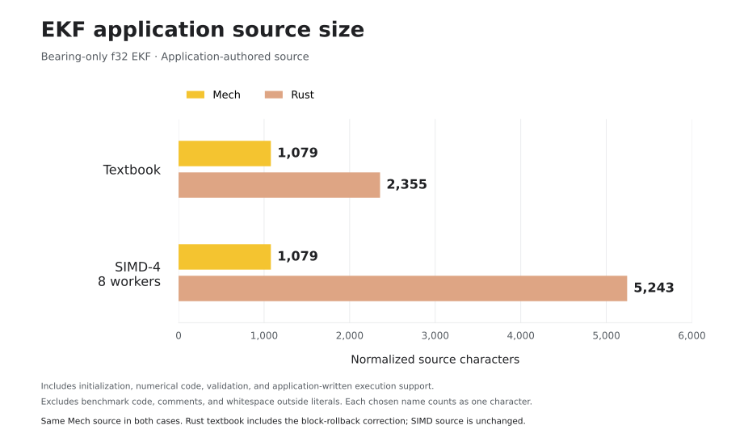

# One EKF, many machines: why Mech for robotics?

Rust can match Mech's performance. That is not the surprising result here.
The useful result is that the Mech program does not have to turn into a
hand-written SIMD and worker-pool implementation to get there.

This repository snapshot puts the IROS workshop evidence on one branch based
on `origin/integration/v0.4`. It preserves the broad cross-language benchmark,
the matched Rust–Mech comparison, the exact source-size audit, the benchmark
programs, raw result records, and the scripts used to inspect them.

## The broad result: one Mech program spans many backends


The chart is a map of implementation strategies, not a league table of
languages. It includes scalar interpreters, vectorized array programs,
single-core SIMD/JIT execution, worker pools, synchronized GPU kernels, and
native Metal. Some rows use 10,000 filters × 20 turns; the matched native and
runtime rows use 500,000 filters × 40 turns. GPU rows are hatched, CPU rows are
solid, and the horizontal scale is logarithmic.

That heterogeneity is the point. The Mech rows come from one high-level EKF
program lowered through different execution backends. In the archived Apple
M1 measurements, Mech ranges from a checked scalar evaluator at 0.919 million
EKF turns/s to direct Metal at 422.702 million turns/s. Changing the backend
changes the physical execution strategy without requiring a new user-level
EKF implementation.

The chart also keeps optimized controls for Rust, Mojo, Julia, Taichi, Halide,
Futhark, NumPy/Numba, Lua/LuaJIT, CPython, and PyPy. Those programs are valuable
controls, but they are not all source-identical or boundary-identical. Use them
to understand the available performance spectrum, not to claim a universal
ranking among languages.

[Open the checked SVG](../archive/compute/parallel-ekf/charts/parallel-ekf-cross-language-checked.svg) ·
[open the unchecked SVG](../archive/compute/parallel-ekf/charts/parallel-ekf-cross-language-unchecked.svg) ·
[open both charts](../archive/compute/parallel-ekf/charts/parallel-ekf-cross-language-full.html)

## The matched result: Rust and Mech are effectively tied

The clearest one-to-one comparison is the checked, fused SIMD block on the
same Apple M1. Both paths run 500,000 filters for 40 turns with four-wide SIMD
and eight workers. Both retain a block-start checkpoint, reject an invalid
block, restore the complete prior state, and return fault metadata.

| Implementation | Checked throughput | Audited application source |
| --- | ---: | ---: |
| Rust packed SIMD, eight workers | 146.509 M turns/s | 5,243 normalized characters |
| Mech SIMD/JIT, eight workers | 145.573 M turns/s | 1,079 normalized characters |

Rust is 0.64% faster in this measurement—well within the range where the
honest conclusion is parity, not a meaningful win. The audited Rust
application is 4.86× the size of the unchanged Mech application. Put another
way, Mech expresses this application boundary with 79.4% fewer normalized
source characters.



The source metric removes comments and nonliteral whitespace and counts every
programmer-chosen identifier occurrence as one character, so long descriptive
Mech names do not inflate the comparison. It retains constants, initialization,
the EKF equations, validation, SIMD adapters, packing, worker dispatch,
checkpointing, and rollback when those are application-authored. It excludes
timers, warmup, reporting, tests, synthetic input generation, and general
compiler/runtime/library internals.

This is a result about these audited implementations, not a proof that every
Rust EKF must be five times larger. A different Rust matrix or parallelism
library would move code across the application/library boundary. The reason to
use Mech is that the language makes that boundary stable: the same 1,079-character
program supplies both the textbook and SIMD/eight-worker Mech columns, while
backend selection and execution plumbing remain reusable runtime concerns.

## Where the extra Rust source goes

The audit partitions every normalized character:

| Category | Mech | Rust SIMD / 8 workers |
| --- | ---: | ---: |
| Setup, constants, declarations | 340 | 561 |
| EKF update and candidate handling | 356 | 1,119 |
| Validation and component extraction | 383 | 396 |
| Application-written matrix helpers | 0 | 310 |
| SIMD wrapper and adapters | 0 | 1,243 |
| Batch dispatch, workers, rollback | 0 | 1,614 |
| **Total** | **1,079** | **5,243** |

The SIMD adapters plus dispatch/rollback account for 87.5% of Rust's growth
from the publication-normalized textbook control to the SIMD/eight-worker
control. The EKF update itself grows by only 95 normalized characters. This is
the engineering leverage Mech is intended to provide: changing where and how
the program executes without rewriting the numerical application around the
new execution model.

## What is included

The full archive contains more variants than the article needs, so the
publication story should lead with only these representative sources:

- [Mech EKF](../archive/compute/parallel-ekf/source-size-audit/selected/ekf.mec)
  and the matched [Rust SIMD control](../archive/compute/parallel-ekf/source-size-audit/selected/rust_simd.rs).
- [NumPy](../archive/compute/parallel-ekf/minimal/numpy_fast.py),
  [Julia](../archive/compute/parallel-ekf/minimal/julia_simd_threads.jl),
  [Taichi](../archive/compute/parallel-ekf/minimal/taichi_optimized.py),
  [Halide](../archive/compute/parallel-ekf/minimal/halide_ekf.cpp), and
  [Futhark](../archive/compute/parallel-ekf/minimal/futhark_ekf.fut) optimized controls.
- [Mojo fixed-matrix](../archive/compute/parallel-ekf/mojo_textbook_fixed.mojo),
  [Mojo Metal](../archive/compute/parallel-ekf/mojo_metal.mojo), and the
  identical-source [CPython/PyPy control](../archive/compute/parallel-ekf/pypy_optimized.py).
- [Raw benchmark evidence](../archive/compute/parallel-ekf/results/) and the
  complete [source-size audit](../archive/compute/parallel-ekf/source-size-audit/README.md).

`manifest.json` pins the v0.4 base, evidence revisions, machine, headline
values, representative source hashes, and selected chart rows.

## Reproduce and verify

Verify the consolidated package from the repository root:

```sh
python3 benchmarks/iros-2026/verify.py
```

Recompute the source audit with only the Python standard library:

```sh
cd benchmarks/archive/compute/parallel-ekf/source-size-audit
python3 measure.py
python3 -m unittest -v test_measure
python3 breakdown.py
```

Build and run the stable v0.4 Mech backend benchmark on a machine with a
supported GPU:

```sh
cargo run -p mech-gpu --release --features native,jit \
  --example parallel_ekf_benchmark -- 10000 20 3 20
```

The current-head rerun is a compatibility check, not a replacement for the
matched historical eight-worker result. Never combine checked and unchecked
rows, per-turn and fused-block boundaries, or measurements from different
machines into a speedup claim.

## Publication language

A concise claim supported by this package is:

> On an Apple M1, the checked eight-worker SIMD implementations delivered
> 145.573 million EKF turns/s in Mech and 146.509 million in Rust. The audited
> Mech application used 1,079 normalized source characters versus 5,243 for
> the Rust SIMD implementation—near-identical throughput with about one-fifth
> of the application source for these implementations.

The broad chart supports a different claim:

> A single high-level Mech EKF source can target scalar, SIMD, JIT, WGPU, and
> native Metal execution. The surrounding language controls show the range of
> strategies available on the same workload; they are not a universal language
> ranking.
