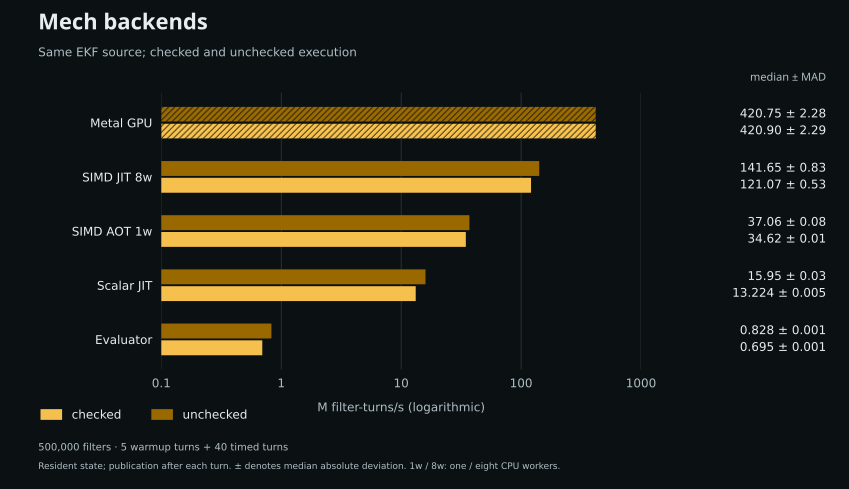
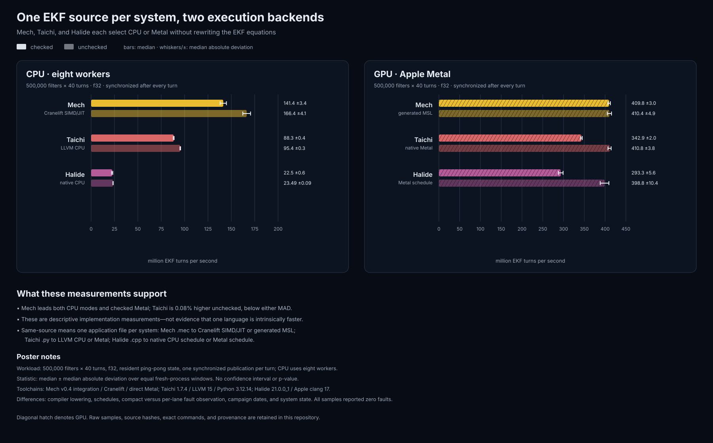
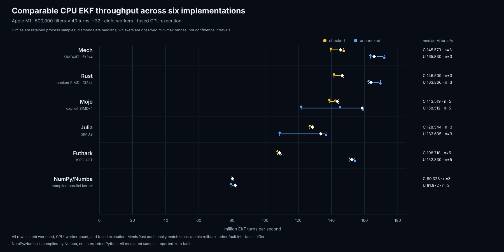
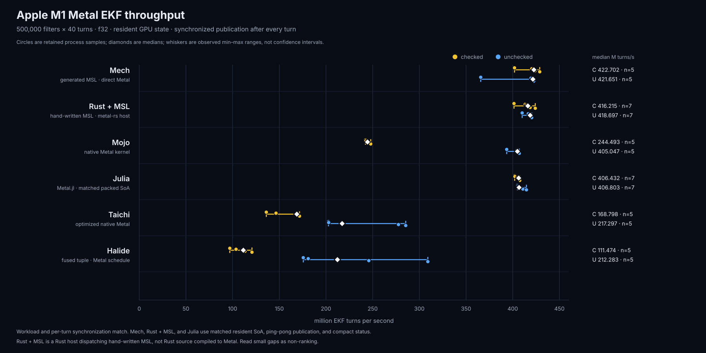
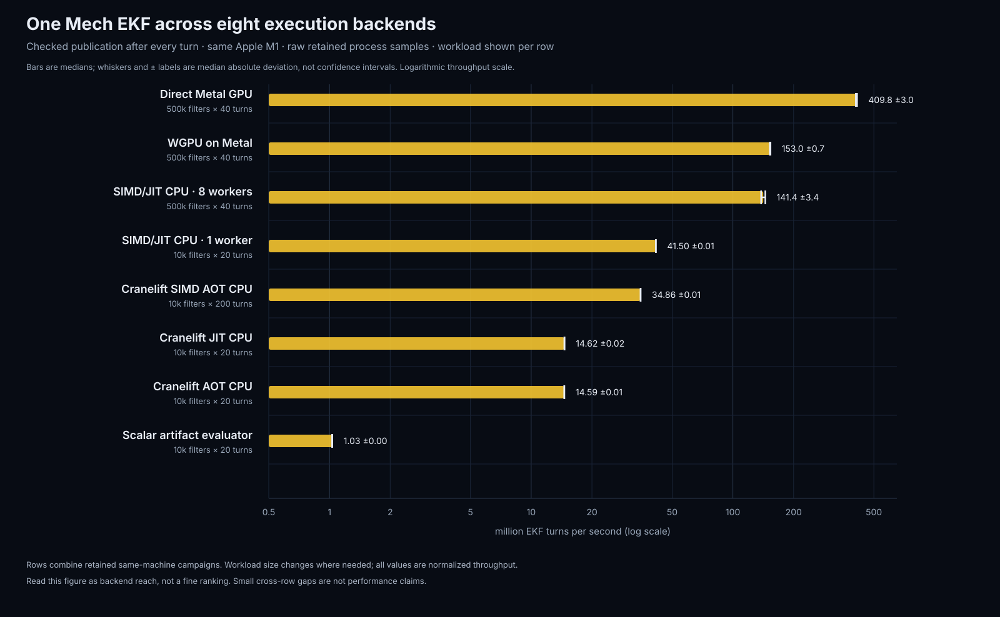

# Embedded numerical kernels for Rust: IROS workshop evidence

Rust's memory safety and systems-level control are useful in robotics.
Numerical kernels can still require substantial application code, especially
when SIMD layouts, worker coordination, and GPU execution are implemented
separately. Mech complements Rust with typed matrix equations, reusable backend
lowering, and checked state publication for successive input updates. This
repository studies those features using a bearing-only extended Kalman filter
(EKF), including its Rust embedding interface and measured backend implementations.

This repository snapshot puts the IROS workshop evidence on one branch based
on `origin/integration/v0.4`. It preserves the broad cross-language benchmark,
the matched Rust–Mech comparison, the exact source-size audit, the benchmark
programs, raw result records, and the scripts used to inspect them.

The [four-story evidence ledger](EVIDENCE.md) maps the Embeddable, Numerical,
Reactive, and Heterogeneous claims to exact artifacts and lists the remaining
experiments or integration work required before publication.

## Embedding the EKF in Rust

The [checked-in Rust consumer](../../examples/embedded_ekf/main.rs) compiles the
[Mech kernel](../../examples/embedded_ekf/ekf.mec), starts an independent resident
session, submits a measurement update, and reads a source-named state export:

```rust
use mech::kernel::{Backend, Kernel};
let source = include_str!("ekf.mec");
let kernel = Kernel::from_source(source)
    .input("bearing", [-0.55; 4])
    .export("state")
    .compile(Backend::Jit)?;
let mut ekf = kernel.start()?;
ekf.turn([("bearing", [-0.54; 4])])?;
let state = ekf.state("state")?;
```

These are implemented calls, excerpted from the runnable example. The
[interface documentation](../../docs/embedding-kernels.md) explains input
shapes, independent sessions, exported state, JIT/AOT compilation, and rejected
turns. The embedding API's 21 integration tests pass. JIT code is compiled once
and reused across sessions.

The [AOT producer](../../examples/embedded_ekf/build.rs) compiles the same source
and saves a dylib with its typed interface metadata. A separate
[Rust consumer](../../examples/embedded_ekf/load.rs) loads that trusted bundle
without parsing, lowering, compiling, or linking:

```rust
let kernel = unsafe { Kernel::load_bundle("ekf.bundle")? };
let mut ekf = kernel.start()?;
ekf.turn([("bearing", [-0.54; 4])])?;
```

Loading native code requires trusting the complete bundle and using compatible
hardware and Mech builds. Integrity digests detect corruption and mismatched
files, not malicious code. The current consumer feature still includes compiler
dependencies, although loading does not invoke them. Arbitrary standalone dylibs
without matching metadata and generated-kernel `rlib` emission are not supported.
The archived dylib size/RSS experiment uses a separate minimal ABI loader and
does not measure the new embedding wrapper.

## Mech backends: matched checked and unchecked

Current poster: [editable PowerPoint](poster/IROS-2026-Mech-Poster-integrated.pptx),
[PDF](poster/IROS-2026-Mech-Poster-integrated.pdf), and
[preview](poster/IROS-2026-Mech-Poster-integrated.png).

The reactive diagram uses one build/activation path ending in the resident
instance, an input/program/output/failure key, activation failure, aligned
publication/rejection outcomes, and a white Rust logo. The
turn-800 example state has a matching angled position-covariance ellipse with
unequal axes. The [example output and reproduction](poster/reactive-output/README.md)
record its inputs and provenance. These illustrative values are separate from
the throughput measurements.

Rust logo © Rust Foundation, [CC BY 4.0](https://creativecommons.org/licenses/by/4.0/),
recolored white from the [official artwork](https://github.com/rust-lang/rust-artwork/blob/main/logo/rust-logo-single-path.svg).

The native Mech chart explicitly sets its logarithmic baseline to 0.1 and
preserves the interpreter bars' series colors. The PDF and PNG show the intended
layout. The in-app PPTX preview has rendered this logarithmic chart as linear,
so use the linked PDF/PNG for the visual reference. This revision still needs
a visual check in Microsoft PowerPoint.



The 2026-09-25 campaign runs all five implementations from source revision
`f4b69052cc6d1d618e1c80acac947795ab2e8472`. Every row uses the same f32 EKF,
seven live input bindings, 500,000 filters, five warmup turns followed by 40
timed turns in the same session, and publication after every turn. There are ten
fresh processes per backend/mode, scheduled in ten shuffled rounds. Values are
median ± unscaled MAD in million filter-turns/s; no samples were removed.

| Backend | Checked | Unchecked |
| --- | ---: | ---: |
| Evaluator, one worker | 0.695 ± 0.001 | 0.828 ± 0.001 |
| Scalar JIT, one worker | 13.224 ± 0.005 | 15.949 ± 0.033 |
| SIMD AOT, one worker | 34.617 ± 0.010 | 37.059 ± 0.085 |
| SIMD JIT, eight workers | 121.071 ± 0.528 | 141.645 ± 0.832 |
| Metal GPU | 420.896 ± 2.291 | 420.747 ± 2.283 |

All 100 measured samples and ten full-state numerical preflights passed. The
five checked implementations also rejected an injected NaN while preserving
all published state. The completed-record audit passed. The machine was an
Apple M1 running macOS 15.6.1, with Rust 1.96.0-nightly, LLVM 22.1.0, and Apple
Clang 17.0.0. The custom `kernel-bench` profile optimizes the numerical executors
at level 3 while leaving source compiler dependencies at level 0. Compilation,
allocation, warmup, and state readback are outside the timed interval.

See the [raw campaign](results/apple-m1-mech-backend-pairs-n10-2026-09-25.json),
[methods and reproduction](MECH-BACKEND-PAIRS.md), and
[read-only auditor](audit_mech_backend_pairs.py). This is a comparison of
execution strategies for this kernel, not a universal performance ranking.
The lower evaluator, scalar JIT, and SIMD JIT values relative to some archived
rows do not isolate a regression: the new campaign uses a common workload,
per-turn publication, seven live bindings, and five preceding turns. Some older
CPU kernels embedded four bindings as constants and used different timing
windows or fused execution.

## Archived same-source CPU and Metal comparison, 2026-09-24



Mech, Taichi, and Halide are the three measured systems in this package that
select both CPU and Apple Metal execution for this EKF from the same
application source. The equations and publication contract stay in one `.mec`,
`.py`, or `.cpp` file; a backend choice and schedule select the device. The
standalone [CPU chart](charts/post-portable-cpu-comparison.svg) and [Metal
chart](charts/post-portable-metal-comparison.svg) retain the two panels above.
This archived ecosystem comparison is separate from the new Mech-only campaign.

For this workload on this Apple M1, Mech has the highest fresh n=10 median in
both CPU modes and checked Metal. On unchecked Metal, Taichi's 410.771 M/s
median is 0.08% above Mech's 410.439 M/s, far below either row's MAD. The CPU
medians are Mech 141.362/166.407 M/s, Taichi 88.344/95.363 M/s, and Halide
22.526/23.490 M/s checked/unchecked. Metal measures Mech 409.765/410.439,
Taichi 342.872/410.771, and Halide 293.291/398.765 M/s. These are descriptive
results for the measured implementations. Compiler lowering, schedules, fault-status observation,
and system state differ and are called out directly in the figure.

All rows use 500,000 filters × 40 turns, f32 state, resident ping-pong
publication, and a synchronization boundary after every turn; CPU rows use
eight workers. Every comparison row contains ten fresh processes, scheduled in
a deterministic shuffled order. Bars report medians and whiskers report median
absolute deviation (MAD), so isolated interference samples cannot dominate the
visual range. These are not confidence intervals. Sample counts and `C`/`U`
prefixes are intentionally omitted from the chart; the legend and bar order
identify checked and unchecked. No samples were removed; every raw process
record remains in JSON.

## Archived cross-language CPU comparison, 2026-09-24



This full CPU figure includes Mech, Rust, Mojo, Julia, Futhark, Taichi,
NumPy/Numba, and Halide. Every implementation runs 500,000 filters for 40 turns
in f32 with eight workers on the same Apple M1. Every row uses ten fresh
processes from the same randomized/interleaved campaign.

| Implementation | CPU strategy | Checked median ± MAD | Unchecked median ± MAD |
| --- | --- | ---: | ---: |
| Mech | SIMD/JIT, f32x4 | 151.323 ± 2.564 M/s | 184.137 ± 8.125 M/s |
| Rust | packed f32x4 | 149.941 ± 2.494 M/s | 170.490 ± 1.720 M/s |
| Julia | SIMD.jl | 129.047 ± 2.844 M/s | 136.402 ± 1.077 M/s |
| Mojo | explicit SIMD-4 | 119.291 ± 0.442 M/s | 128.152 ± 0.229 M/s |
| Futhark | ISPC AOT | 97.897 ± 1.162 M/s | 149.931 ± 1.370 M/s |
| Taichi | LLVM CPU, per-turn publication | 88.344 ± 0.421 M/s | 95.363 ± 0.316 M/s |
| NumPy/Numba | compiled parallel kernel | 79.380 ± 0.550 M/s | 81.557 ± 0.350 M/s |
| Halide | native CPU, per-turn publication | 22.526 ± 0.649 M/s | 23.490 ± 0.092 M/s |

The strict one-to-one anchor inside the wider figure is Mech versus Rust: both
use four-wide packed SIMD, eight workers, fused execution, and block-atomic
rollback. Their observed ranges overlap in both modes. In this campaign Mech's
median is 0.92% higher checked and 8.00% higher unchecked. The checked result
is effectively tied at this resolution; the unchecked separation is an
implementation/code-generation result, not proof of a language advantage.

The other implementations match workload, CPU, worker count, and precision,
but their fault interfaces are not identical. Mech, Rust, Mojo, Julia,
Futhark, and Numba fuse the 40-turn worker-local block; Taichi and Halide
synchronize publication after each turn. NumPy/Numba means an LLVM-compiled
Numba kernel launched from Python, rather than interpreted Python or eager NumPy. Read
this full chart as an implementation landscape, not a strict language ranking.
MAD whiskers are robust descriptive spread, not confidence intervals.

The larger archive also contains CPython, PyPy, and other controls. They remain
in the mega charts when their retained evidence
changes the workload size, execution shape, device, or arithmetic contract.

[Open the full checked mega chart](../archive/compute/parallel-ekf/charts/parallel-ekf-cross-language-checked.svg) ·
[open the unchecked SVG](../archive/compute/parallel-ekf/charts/parallel-ekf-cross-language-unchecked.svg) ·
[open both charts](../archive/compute/parallel-ekf/charts/parallel-ekf-cross-language-full.html)

## The Metal result: six implementation ecosystems



This Metal-only figure keeps the workload and synchronization boundary fixed:
500,000 filters × 40 turns, resident f32 state, and one completed Metal
publication per turn. It compares Mech-generated MSL, a Rust host dispatching
hand-written MSL, Mojo, Julia/Metal.jl, Taichi, and Halide.

| Implementation | Metal path | Checked median ± MAD | Unchecked median ± MAD |
| --- | --- | ---: | ---: |
| Rust + MSL | hand-written MSL, `metal-rs` host | 425.180 ± 3.083 M/s | 422.890 ± 4.917 M/s |
| Julia | Metal.jl, matched packed SoA | 410.420 ± 4.744 M/s | 411.398 ± 13.386 M/s |
| Mech | generated MSL, direct Metal | 409.765 ± 2.954 M/s | 410.439 ± 4.921 M/s |
| Mojo | native Metal, matched packed SoA | 406.038 ± 5.165 M/s | 405.355 ± 6.941 M/s |
| Taichi | native Metal, matched packed SoA | 342.872 ± 2.030 M/s | 410.771 ± 3.794 M/s |
| Halide | packed SoA, native Metal | 293.291 ± 5.583 M/s | 398.765 ± 10.403 M/s |

The Rust control was added specifically to test whether Mech's 422.702 M/s
result depended on an unavailable trick. It uses resident SoA buffers, one GPU
thread per filter, paired trigonometry, explicit fused arithmetic, 64-thread
threadgroups, ping-pong publication, a two-word shared fault status, and one
command buffer plus wait per turn. Its fresh n=10 median is 3.76% above Mech
checked and 3.03% above Mech unchecked; the raw observed ranges overlap. This
supports the useful claim that Mech generates a Metal execution strategy in
the same performance band as a hand-written Metal kernel; it does not show
that Metal itself favors Mech.

Stable Rust does not directly compile Rust kernels to Apple Metal, so that row
is accurately labeled “Rust + MSL”: Rust owns the host and a hand-written MSL
kernel owns GPU execution.

The matched Mojo control now uses the same component-major packed SoA,
resident ping-pong publication, fast device transcendentals, 64-thread launch
geometry, and per-turn synchronization as the Mech and Rust paths. Checked
mode adds candidate predicates and a two-word device fault status; after the
required synchronization, Mojo reads those eight status bytes directly from
Apple unified memory. That removes the old checked path's full host mapping
and raises the fresh n=10 median from the archived 244.493 to 406.038 M turns/s.
Checked and unchecked differ by only 0.17%, so this campaign does not resolve
any checking cost. Mojo is 0.91% below Mech checked and 1.24% below it
unchecked; both gaps are smaller than the reported MADs. Matching state layout,
publication, math lowering, launch geometry, and fault transport closed the
large historical checked gap. All raw samples remain in JSON.

Julia compiles its Julia kernel through Metal.jl. The matched Julia control
gives both modes the same component-major packed SoA, resident ping-pong
buffers, 64-thread launch geometry, and per-turn synchronization. Checked mode
adds only the candidate predicates and a shared two-word fault status. Its
checked median is 0.09% below unchecked and the observed ranges overlap,
replacing the earlier host-transport-heavy path with a like-for-like
measurement of checking.

The matched Halide control likewise replaces its older fixed-shape tuple path
with packed resident state, ping-pong publication, and a 256-thread Metal
schedule. The fresh unchecked median rises from the archived 212.283 to
398.765 M turns/s. Halide
21's generated Metal path does not expose the compact device-wide atomic status
used by the other matched controls, so checked mode uses a resident per-lane
fault plane that must be observed after each turn; that remaining interface
cost is reported rather than hidden.

That exact Halide source also selects an eight-worker CPU schedule. The
fresh n=10 chart medians are 22.526 M turns/s checked and 23.490 M/s
unchecked. Together with the same-source Taichi result and
Mech's unchanged high-level EKF, this supplies the focused portability story:
all three target CPU and Metal from one application source. Mech has the
highest CPU and checked-Metal median; Taichi's unchecked-Metal median is 0.08%
higher than Mech's, much smaller than either MAD. Toolchain, schedule, and
status-observation differences make this descriptive, not a language ranking.

The matched Taichi control replaces the archived comparison in this figure.
Both modes now use one packed component-major field, identical resident double
buffers, a 64-thread launch, and the same synchronized ping-pong publication.
Checked mode adds the integrity predicates, atomics only on fault, and one
compact cumulative-status read after synchronization; the cumulative counter
avoids a per-turn reset transfer while preserving whole-turn rollback. Its
342.872 M turns/s checked median versus 410.771 M/s unchecked is therefore a
16.53% measured cost of Taichi's checked protocol, not a comparison between
different state layouts or in-place versus double-buffered execution.

The same Taichi source selects its LLVM CPU backend with one option and uses a
backend-specialized packed axis order without changing the EKF equations or
publication contract. The fresh CPU chart medians are 88.344 M turns/s checked
and 95.363 M/s unchecked. This per-turn synchronized result documents
Taichi's same-source backend portability. It now appears in the full CPU panel
with its different publication boundary labeled explicitly; NumPy/Numba
remains the separate compiled Python-ecosystem row.

All rows share the successful-path workload and resident packed SoA,
ping-pong publication, and per-turn synchronization; all but Halide use a
compact shared fault status. Compiler contraction, transcendental lowering,
launch geometry, host API overhead, and campaign dates can still move results.
Use medians and MAD as a backend landscape; do not turn small gaps into a
ranking.

## Archived backend overview and AOT diagnostics



The five-backend paired campaign above supersedes this mixed-workload overview
for the poster. These older measurements remain available as historical evidence.

These eight rows use the same high-level Mech EKF and change the execution
backend: the scalar artifact evaluator, Cranelift JIT, scalar and four-lane
Cranelift AOT, one- and eight-worker SIMD/JIT, WGPU on Metal, and direct Metal.
All rows are checked and publish after every turn. The 10,000-filter CPU rows
and 500,000-filter parallel/GPU rows come from retained same-machine campaigns,
so normalized throughput makes the backend span visible, but small cross-row
gaps are not ranking claims.

The scalar AOT path shares the JIT's Cranelift lowering, emits a host object,
links a reusable native library, and reloads its exported turn function. Five
release processes produced a 14.593 M turns/s AOT median (14.089-14.644
observed range) and a 14.618 M turns/s JIT median (14.068-14.641) in the same
processes. Both matched scalar state bit-for-bit. A cold emit/link/load took
202.029 ms; cached loads had a 3.283 ms median. These timings support equivalent
steady-state execution, not a claim that either compiler mode is faster.

The new `cpu-aot-simd` option saves a different AOT library with four-filter
`f32x4` arithmetic, packed resident state, paired sine/cosine evaluation, and
the same checked rollback contract. It is selected by the backend registry or
directly through `compile_aot_simd_cpu`; the scalar `cpu-aot` option remains as
the exact-ABI baseline.

AOT and SIMD are orthogonal here. AOT describes when the native code is
compiled and that it is saved as a reusable library; SIMD describes how the
kernel executes independent filters. Mech supports scalar AOT and SIMD AOT,
and the performance difference comes from the lowering strategy rather than
from whether the library was loaded from disk.

### AOT code-generation diagnostic

The separate, archived dynamic-library control uses 10,000 filters × 200
checked turns, preceded by 100 untimed turns and a full state reset.
The same minimal loader measures scalar Mech AOT,
four-lane Mech AOT, and a hand-specialized Rust `cdylib`; compiler/build time,
allocation, packing, warmup, and reset are outside the timed region. All rows
use one host thread and checked publication after every turn.

This table is a backend diagnostic, not the Rust–Mech language comparison.
Scalar Mech and Rust share an ABI and workload, but not the same generated
optimization: LLVM applies local SLP vectorization and combines sine/cosine
calls in the Rust kernel, while scalar Cranelift AOT does not. Conversely,
four-lane Mech AOT uses packed cross-filter SIMD that the Rust dylib does not.

| Implementation | Steady-state throughput, median ± MAD (observed min-max), n=7 | Library size | Peak process RSS, median ± MAD (observed min-max), n=7 |
| --- | ---: | ---: | ---: |
| Mech scalar Cranelift AOT | 14.671 ± 0.008 M/s (14.458-14.679) | 33,544 B | 2,818,048 ± 0 B (2,818,048-3,014,656) |
| Optimized Rust `cdylib` | 21.121 ± 0.005 M/s (21.097-21.129) | 50,016 B | 2,818,048 ± 0 B (2,818,048-2,916,352) |
| Mech four-lane Cranelift AOT | 34.863 ± 0.010 M/s (34.847-34.927) | 33,864 B | 2,818,048 ± 0 B (2,818,048-2,818,048) |

Rust is 43.96% ahead of scalar AOT because of that code-generation and
hand-specialization gap, not because dynamic libraries favor Rust or because
Mech is intrinsically slower. Scalar AOT and scalar JIT are effectively tied
in the matched Mech-only measurement above, demonstrating that AOT packaging
does not itself impose the gap.

Four-lane AOT is 65.07% faster than the scalar Rust control and 137.63% faster
than scalar AOT in this campaign. Its packed state and
four-filter vector body are a different physical strategy. Rust can and does
use the same strategy in the matched checked/unchecked comparison above. The
result demonstrated here is that Mech can select AOT packaging and SIMD
lowering together without changing the user-level EKF source.

Both generated Mech libraries are about one-third smaller on disk than the Rust
library. A [follow-up size audit](DYLIB-SIZE-AUDIT.md) reproduced the Rust file
size and found that the gap is primarily Mach-O linker and segment layout:
Rust has an additional 16 KiB data segment containing 24 bytes of lazy-linking
data. It is not evidence that Mech produces smaller numerical machine code.
All three median peak-RSS values are identical and their observed
ranges overlap, so these seven processes do not establish a memory-use
difference. Peak RSS includes the common loader and live buffers; it is not
private library memory. All runs reported zero faults, and
complete final states agreed within 4.09e-4 after 200 turns. See the [raw
seven-process record](results/apple-m1-aot-vs-rust-dylib-2026-09-24.json) and
the [common-loader control](rust-dylib/README.md).

## Numerical source and backend-specific application code

The matched comparison answers the performance question in both modes: Rust
and Mech are comparable when workload, SIMD width, worker count, fusion, and
integrity contract are aligned. The retained n=10 fused comparison reports
151.323/149.941 M/s for checked Mech/Rust and 184.137/170.490 M/s unchecked.
Observed ranges overlap in both modes. These are the archived cross-language
values, not the new per-turn backend rates.

The engineering difference is how much application code is required to reach
that execution shape. The audited Rust SIMD/eight-worker application contains
5,243 normalized characters; the unchanged Mech application contains 1,079.
In this case the optimized Rust source is almost five times as long, with much
of the additional code devoted to SIMD adapters, worker dispatch, and rollback.
The audit counts the archived application sources; it does not count the newly
added Rust embedding example or assign its source size to the new campaign.

The source metric removes comments and nonliteral whitespace and counts every
programmer-chosen identifier occurrence as one character, so long descriptive
Mech names do not inflate the comparison. It retains constants, initialization,
the EKF equations, validation, SIMD adapters, packing, worker dispatch,
checkpointing, and rollback when those are application-authored. It excludes
timers, warmup, reporting, tests, synthetic input generation, and general
compiler/runtime/library internals.

This is a result about these audited implementations, not a proof that every
Rust EKF must be five times larger. A different Rust matrix or parallelism
library would move code across the application/library boundary. The reason to
use Mech in this setting is to keep those numerical equations in application
source while moving backend-specific packing, dispatch, and publication code
into reusable implementations. The audited 1,079-character program supplies
both the textbook and SIMD/eight-worker Mech columns.

## Where the extra Rust source goes

The audit partitions every normalized character:

| Category | Mech | Rust SIMD / 8 workers |
| --- | ---: | ---: |
| Setup, constants, declarations | 340 | 561 |
| EKF update and candidate handling | 356 | 1,119 |
| Validation and component extraction | 383 | 396 |
| Application-written matrix helpers | 0 | 310 |
| SIMD wrapper and adapters | 0 | 1,243 |
| Batch dispatch, workers, rollback | 0 | 1,614 |
| **Total** | **1,079** | **5,243** |

The SIMD adapters plus dispatch/rollback account for 87.5% of Rust's growth
from the publication-normalized textbook control to the SIMD/eight-worker
control. The EKF update itself grows by only 95 normalized characters. This is
an example of the application code needed to specialize this Rust kernel for
the selected parallel backend.

## What is included

The full archive contains more variants than the article needs, so the
publication story should lead with only these representative sources:

- [Mech EKF](../archive/compute/parallel-ekf/source-size-audit/selected/ekf.mec)
  and the matched [Rust SIMD control](../archive/compute/parallel-ekf/source-size-audit/selected/rust_simd.rs),
  plus the [Rust-hosted MSL control](rust-metal/README.md).
- [NumPy/Numba](../archive/compute/parallel-ekf/minimal/numpy_numba.py),
  [Julia](../archive/compute/parallel-ekf/minimal/julia_simd_threads.jl),
  [matched Taichi Metal](taichi-metal-matched.py),
  [matched Halide Metal](halide-metal-matched.cpp), and
  [Futhark](../archive/compute/parallel-ekf/minimal/futhark_ekf.fut) optimized controls.
- [Mojo fixed-matrix](../archive/compute/parallel-ekf/mojo_textbook_fixed.mojo),
  [matched Mojo Metal](mojo-metal-matched.mojo), and the
  identical-source [CPython/PyPy control](../archive/compute/parallel-ekf/pypy_optimized.py).
- [Matched Julia Metal.jl](julia-metal-matched.jl)
  and the retained direct-Metal record for Mech.
- [Raw benchmark evidence](../archive/compute/parallel-ekf/results/) and the
  complete [source-size audit](../archive/compute/parallel-ekf/source-size-audit/README.md).

`manifest.json` pins the v0.4 base, evidence revisions, machine, headline
values, representative source hashes, selected chart rows, and the descriptive
statistics policy.

## Same-machine provenance

The Mojo, Halide, and Taichi rows are not measurements imported from another
computer. Their raw records identify this Mac mini (Macmini9,1), Apple M1,
8 GB, macOS 15.6.1, arm64, the same identity reported by the machine on
2026-09-24.

The filesystem audit also found the Halide 21.0.0_1 installation with an
August 31 install timestamp, the Taichi 1.7.4 compiled-kernel cache populated
during the August/September campaigns, and the exact Mojo nightly compiler
cache. The temporary Mojo environment itself no longer existed. Taichi 1.7.4
was reconstructed exactly. The publication Metal figure now uses a fresh,
matched Mojo control built with Mojo 1.1.0 and MAX 26.6.0; this is a new
measurement with its toolchain pinned in the raw record, not a relabeling of
the archived nightly result.

Fresh seven-process reruns of the historical Halide and Taichi programs
confirmed that the sources and toolchains still execute correctly, but their
medians moved materially from the original campaigns. That is useful evidence
about benchmark sensitivity, not a reason to overwrite the retained results.
The publication chart instead uses separately recorded matched Mojo, Taichi,
and Halide implementations. Historical rerun samples and the audit remain in
[the same-machine rerun record](results/same-machine-reruns-2026-09-24.json).

## Reproduce and verify

Verify the consolidated package from the repository root:

```sh
python3 benchmarks/iros-2026/verify.py
```

Regenerate all six publication figures from the retained raw samples:

```sh
python3 benchmarks/iros-2026/plot_post_charts.py
```

The equal-window campaign is driven by
[`measure_n10_campaign.py`](measure_n10_campaign.py). It accepts prebuilt
Mech, Rust, Mojo, Futhark, and Halide controls plus the pinned Python and Julia
executables, then runs ten fresh processes per implementation/mode in a
deterministic shuffled order. The two complete records are
[`apple-m1-cpu-equal-n10-2026-09-24.json`](results/apple-m1-cpu-equal-n10-2026-09-24.json)
and
[`apple-m1-metal-equal-n10-2026-09-24.json`](results/apple-m1-metal-equal-n10-2026-09-24.json).
No samples were removed or replaced.

The CPU Mech binary is pinned to evidence revision `eedc1c75` and carries the
recorded [`mech-cpu-n10-validation-tolerance.patch`](mech-cpu-n10-validation-tolerance.patch).
With the current compiler, the harness's untimed 40-turn scalar-versus-SIMD
cross-check reached `1.60e-4`, so the assertion threshold was raised from
`1e-4` to `2e-4`. The patch changes neither the benchmarked implementation nor
any timed region; its exact scope and every benchmark binary hash are retained
in both campaign records.

Rebuild and rerun the Rust-hosted hand-written Metal control:

```sh
python3 benchmarks/iros-2026/measure_rust_metal.py \
  --samples 7 --instances 500000 --turns 40
```

Rerun the matched Julia/Metal.jl control:

```sh
python3 benchmarks/iros-2026/measure_julia_metal.py \
  --samples 7 --instances 500000 --turns 40
```

Rebuild and rerun the matched Mojo, Taichi, and Halide Metal controls:

```sh
python3 benchmarks/iros-2026/measure_mojo_metal.py \
  --mojo /path/to/mojo --samples 7 --instances 500000 --turns 40
python3 benchmarks/iros-2026/measure_taichi_metal.py \
  --python /path/to/taichi-python --arch metal \
  --samples 7 --instances 500000 --turns 40
python3 benchmarks/iros-2026/measure_halide_metal.py \
  --samples 7 --instances 500000 --turns 40
```

Rebuild and remeasure the Rust/Mech dynamic-library control after first
producing the Mech AOT library:

```sh
python3 benchmarks/iros-2026/measure_dylib_comparison.py \
  target/mech-aot-final-v2/mech-0a9d1856e310433b75da7d519ccc856597d751f7af345a38c70d43d289ec24fd.dylib \
  --mech-simd-dylib target/mech-aot-final-v2/mech-simd-633e21301b05367c3cadd6c59b1fdbdcf102cd909a23acd1655f897aeb3045db.dylib \
  --samples 7 --instances 10000 --turns 200
```

Recompute the source audit with only the Python standard library:

```sh
cd benchmarks/archive/compute/parallel-ekf/source-size-audit
python3 measure.py
python3 -m unittest -v test_measure
python3 breakdown.py
```

Build and run the stable v0.4 Mech backend benchmark on a machine with a
supported GPU:

```sh
cargo run -p mech-gpu --release --features native,aot \
  --example parallel_ekf_benchmark -- 10000 20 3 20
```

The current-head rerun is a diagnostic compatibility check, not a replacement
for the matched historical eight-worker result. Never combine checked and
unchecked rows, per-turn and fused-block boundaries, or measurements from
different campaigns into a speedup claim.

On 2026-09-24, the stable v0.4 Mech benchmark passed the compile check above.
The exact Rust SIMD control was also rebuilt and rerun in isolation. Its five
checked fused samples had a 148.056 M turns/s median and a wide
110.795-154.772 M turns/s observed range, with the identical checksum and zero
faults. The bimodal samples make this a compatibility diagnostic, not
performance corroboration. See the [current-head verification
record](results/current-v0.4-verification-2026-09-24.json).

## Publication language

A concise claim supported by this package is:

> On an Apple M1, matched four-wide SIMD/eight-worker runs produced checked
> medians of 151.323 million EKF turns/s for Mech and 149.941 million for Rust,
> and unchecked medians of 184.137 million for Mech and 170.490 million for
> Rust. These are fresh ten-process medians with MADs of 2.564/2.494 checked
> and 8.125/1.720 unchecked; the observed ranges overlap in both modes. The
> audited Mech application
> used 1,079 normalized source characters versus 5,243 for the Rust SIMD
> implementation, with the same workload and execution shape and about one-fifth of the
> application source. The result compares implementations and compiler paths,
> not the intrinsic speed of either language.

The Mech backend chart supports a different claim:

> At revision `f4b69052c`, the same Mech EKF source and seven live inputs were
> measured across five backends with 500,000 filters and 40 timed turns after
> five warmup turns. Each backend has ten checked and ten unchecked fresh-process
> samples with per-turn publication. Checked medians were 0.695 M filter-turns/s
> for the evaluator, 13.224 for scalar JIT, 34.617 for SIMD AOT, 121.071 for
> eight-worker SIMD JIT, and 420.896 for Metal. The paired results report median
> and MAD and describe this workload and these implementations.

The 14.671 M/s scalar Mech AOT and 21.121 M/s scalar-ABI Rust dylib values must
not be quoted as the language comparison: the generated optimization
strategies differ. They are retained only to diagnose scalar Cranelift versus
LLVM code generation. Likewise, 34.863 M/s SIMD AOT versus the scalar Rust
dylib demonstrates backend selection, not a matched Rust–Mech speedup.
