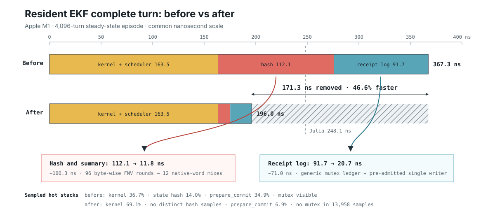

# Resident EKF turn profile and optimization: Apple M1

This profile isolates the one-instance, 4,096-turn Gate B resident EKF on an
Apple M1. Fixture construction, correctness validation, allocation reporting,
and Criterion analysis are excluded from the layer timings and flame graph.
All profiled steady-state lanes report zero allocations. The sampling profile
and first layer table describe the implementation before the follow-up
optimization below.

## Layer subtraction

The profiling-only `mech-resident-prepared` lane adds candidate summary and
state hashing to the scheduled turn, then publishes without preparing or
appending a retained receipt.

| Cumulative layer | Episode | Per turn | Increment |
| --- | ---: | ---: | ---: |
| Resident kernel | 0.5303 ms | 129.5 ns | 129.5 ns |
| Scheduled and published | 0.6702 ms | 163.6 ns | 34.1 ns |
| Summary/hash and published | 1.1300 ms | 275.9 ns | 112.3 ns |
| Complete receipt/ledger turn | 1.5069 ms | 367.9 ns | 92.0 ns |

The absolute times are slower than the earlier Gate B run because this profile
was collected under Time Profiler and a different thermal state. The
incremental attribution is the useful result: candidate summary/hash consumes
about 55% and receipt/ledger work about 45% of the 204 ns turn shell above
scheduled execution.

## Sampling profile

The Time Profiler recording sampled a sustained complete-turn run at 1 kHz.
The SVG keeps only the Criterion hot-turn closure and removes fixture setup and
post-timing validation stacks.

Prominent inclusive frames:

| Frame | Samples |
| --- | ---: |
| `prepare_scheduled_turn` | 56.8% |
| EKF scheduled kernel | 36.7% |
| `candidate_state_hash` | 14.0% |
| `prepare_commit` | 34.9% |
| `accepted_record` | 21.3% |
| ledger `prepare` | 6.6% |
| retained-ledger `append` | 5.2% |

Percentages are inclusive and therefore overlap. The capacity controller's
mutex-backed `bind` and `commit_prepared` transitions appear beneath ledger
prepare/append. They are real costs, but record construction/validation and
state hashing are larger targets.

## Finding

There is an obvious performance-mode boundary. A successful turn currently
hashes all 96 candidate bytes, constructs and validates a 64-byte receipt, and
appends that receipt through the retained ledger even though the computation
and scheduler have already completed. A fail-stop performance mode that omits
the diagnostic hash and per-turn retained receipt should approach the 164 ns
scheduled/published result from this run, below the measured 248 ns Julia EKF
turn.

Open [`resident-ekf-turn-apple-m1.svg`](resident-ekf-turn-apple-m1.svg) in a
browser for the interactive flame graph. Hover for inclusive sample counts,
click a frame to zoom, and use the search control to highlight functions.

## Follow-up optimization

The profile identified two assumptions that the frozen resident executor can
prove ahead of time:

- The state fingerprint is diagnostic, so it can mix the twelve `f64` bit
  patterns directly instead of running FNV over all 96 serialized bytes.
- The turn coordinator has one writer, a fixed receipt type, and a bounded
  admission window. It can reserve the entire receipt array during activation
  and append without the generic ledger's mutex-backed capacity controller.

The specialized recorder still prepares the receipt before publication,
aborts the candidate if preparation fails, retains every accepted or rejected
receipt, and performs no steady-state allocations. The generic retained ledger
is unchanged for concurrent and dynamically sized workloads.

Criterion measurements from the same Apple M1 after the change:

| Cumulative layer | Episode | Per turn | Increment |
| --- | ---: | ---: | ---: |
| Resident kernel | 0.5387 ms | 131.5 ns | 131.5 ns |
| Scheduled and published | 0.6696 ms | 163.5 ns | 32.0 ns |
| Summary/hash and published | 0.7181 ms | 175.3 ns | 11.8 ns |
| Complete receipt/ledger turn | 0.8027 ms | 196.0 ns | 20.7 ns |

Compared with the immediately preceding Criterion baseline, summary/hash
improved from 275.6 ns to 175.3 ns per turn (36.4%), and the complete retained
turn improved from 367.3 ns to 196.0 ns (46.6%). With 100,000 retained history
records the complete turn initially measured 206.6 ns. That gap came from
constructing history after the resident working set and thereby cooling the
working set immediately before timing. With the fixed receipt slots initialized
first, empty and 100,000-record history measured 196.0 ns and 195.9 ns
respectively.

## Follow-up sampling profile

A final Time Profiler recording captured 13,958 samples inside the optimized
Criterion hot-turn closure:

| Frame | Before | After |
| --- | ---: | ---: |
| Scheduled EKF kernel | 36.7% | 69.1% |
| `candidate_state_hash` | 14.0% | no distinct samples |
| `prepare_commit` | 34.9% | 6.9% |
| `prepare_accepted_append` | 32.0% | 1.0% |
| Mutex frames | present | none |

The after profile confirms the layer subtraction: the numerical kernel now
dominates the hot turn, the byte-wise hash is gone, and the specialized
single-writer receipt path no longer enters the generic capacity mutex.

